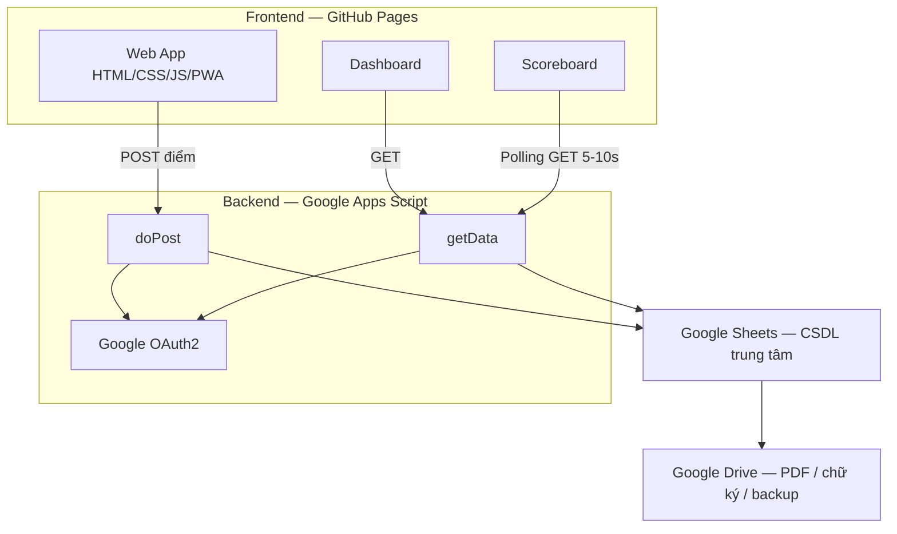
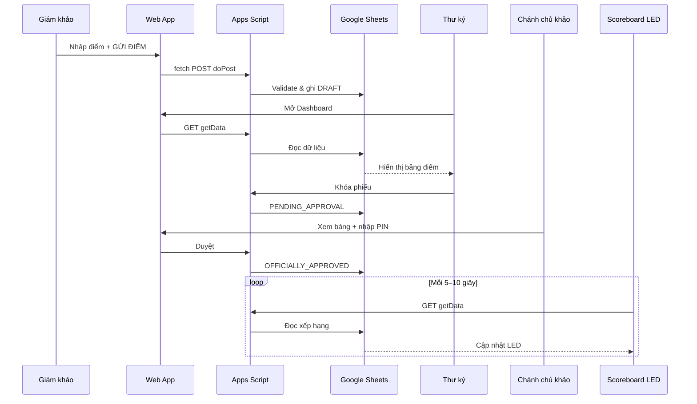
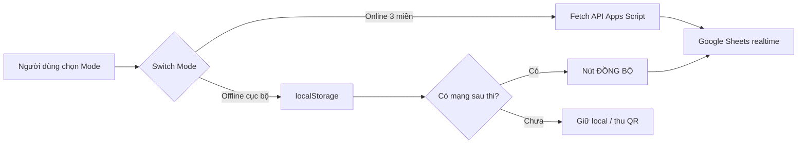
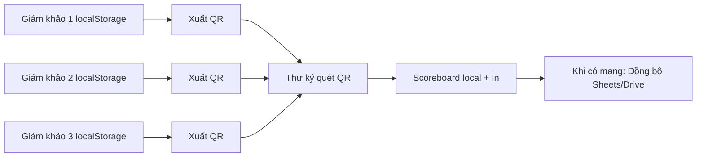
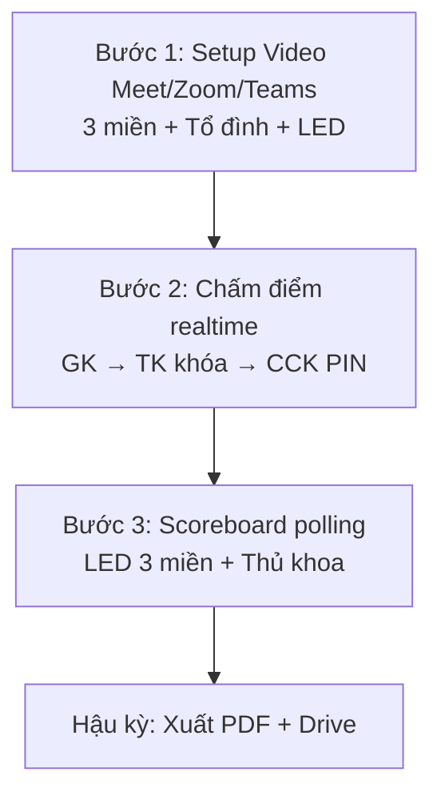
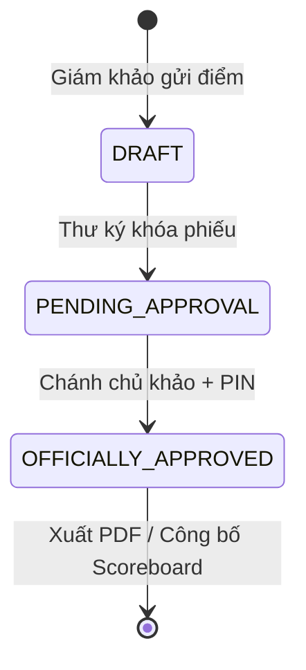

# TÀI LIỆU THIẾT KẾ HỆ THỐNG THI THĂNG ĐAI 2-TRONG-1

**Tên hệ thống:** Hệ thống thi thăng đai 2-trong-1 (Offline & 3 miền Online)  
**Tên gọi khác:** Hệ thống thi thăng đai 3 miền trực tiếp (Live Multi-Region)  
**Khẩu hiệu:** 1 bộ code – 2 kịch bản xử lý – Minh bạch – Trực quan – Gắn kết toàn môn phái  
**Nền tảng cốt lõi:** GitHub + Google Apps Script + Google Sheets  
**Phiên bản tài liệu:** Tổng hợp từ sơ đồ kiến trúc & workflow vận hành chính thức  
**Đối tượng đọc:** Ban tổ chức kỳ thi, lập trình viên mới, người nhận bàn giao dự án, người trình bày proposal

---

# Tổng quan hệ thống

Hệ thống phục vụ **chấm thi thăng đai võ thuật** theo mô hình điện tử, hỗ trợ đồng thời hai kịch bản vận hành trên **cùng một bộ mã nguồn**:

1. **Online 3 miền** — giám khảo tại Bắc / Trung / Nam chấm điểm trực tiếp, dữ liệu tập trung, Scoreboard cập nhật theo thời gian thực.
2. **Offline cục bộ** — chấm thi tại một câu lạc bộ khi không có (hoặc mất) Internet; dữ liệu lưu tạm trên thiết bị, đồng bộ lên Cloud sau khi có mạng.

Người dùng truy cập qua trình duyệt trên **Mobile / Tablet / Laptop**. Giao diện được host trên **GitHub Pages**, ưu tiên **PWA (Offline First)** và responsive.

### Đối tượng sử dụng

| Đối tượng | Mục đích sử dụng |
|---|---|
| Giám khảo tại điểm cầu / CLB | Nhập điểm, nhận xét, gửi hoặc lưu điểm |
| Thư ký Online (tại trung tâm) | Theo dõi Dashboard, rà soát, khóa phiếu |
| Chánh chủ khảo Online (tại trung tâm) | Duyệt kết quả bằng mã PIN |
| Ban tổ chức / Tổ đình | Theo dõi Scoreboard LED, in phiếu, lưu trữ |
| Khán giả / toàn môn phái | Xem bảng xếp hạng công khai trên màn hình LED |

### Mục tiêu của hệ thống

- Số hóa quy trình chấm thi thăng đai.
- Cho phép tổ chức kỳ thi **3 miền cùng lúc** với dữ liệu tập trung.
- Vẫn chạy được khi **mất mạng / sóng yếu** (chế độ Offline).
- Đảm bảo **minh bạch** qua Scoreboard realtime công khai.
- Giảm chi phí hạ tầng (không VPS, không server riêng).
- Lưu trữ hồ sơ dài hạn trên Google Drive.

---

# Mục tiêu dự án

| Mục tiêu | Mô tả |
|---|---|
| **Minh bạch** | Công khai, trực quan 100% — điểm và xếp hạng hiển thị trên Scoreboard LED |
| **Gắn kết** | Kết nối toàn môn phái 3 miền trong cùng một sự kiện trực tiếp |
| **Tiết kiệm** | Giảm chi phí đi lại và tổ chức; chi phí hạ tầng kỹ thuật = 0đ (dùng free tier) |
| **Tập trung** | Dữ liệu lưu trữ an toàn, tập trung trên Google Sheets & Google Drive |
| **Linh hoạt 2-trong-1** | Một hệ thống dùng chung cho mọi điều kiện hạ tầng mạng |
| **Dễ triển khai** | Không cần quản trị VPS/Server; deploy Frontend lên GitHub Pages, Backend qua Apps Script Web App |

---

# Kiến trúc hệ thống

Hệ thống theo mô hình **Frontend (GitHub Pages) → API (Google Apps Script) → Database (Google Sheets) → Storage (Google Drive)**.

```text
Người dùng (Browser / PWA)
        │
        ▼
GitHub Pages  ──  HTML5 / CSS / Javascript / PWA
        │
        │  API POST / GET (Fetch)
        ▼
Google Apps Script (Web App)
  • doPost  — nhận dữ liệu điểm
  • getData — lấy dữ liệu hiển thị
  • Google OAuth2 — xác thực & phân quyền
        │
        ▼
Google Sheets  (CSDL trung tâm)
        │
        ▼
Google Drive   (PDF, chữ ký, con dấu, video/ảnh, backup)
```

### Vai trò từng tầng

| Tầng | Thành phần | Vai trò |
|---|---|---|
| **Frontend** | GitHub Pages + HTML5/CSS/JS + PWA | Giao diện chấm điểm, Dashboard, Scoreboard; chạy trên Mobile/Tablet/Laptop; hỗ trợ Offline First |
| **API Layer** | Google Apps Script (deploy Web App) | Nhận POST/GET, xử lý logic nghiệp vụ, validate dữ liệu, ghi/đọc Sheets |
| **Backend** | Google Apps Script | Xác thực/phân quyền (Google OAuth2), khóa phiếu, duyệt PIN |
| **Database** | Google Sheets | Lưu điểm, trạng thái phiếu, dữ liệu hiển thị Dashboard/Scoreboard |
| **Storage** | Google Drive | PDF phiếu điểm, chữ ký, con dấu, video/hình ảnh, sao lưu dữ liệu |
| **Auth** | Google OAuth2 | Xác thực và phân quyền (được nêu trong kiến trúc; chi tiết flow chưa được mô tả đầy đủ trong hình ảnh) |
| **Video (hạ tầng song song)** | Google Meet / Zoom / Microsoft Teams | Kết nối hình ảnh 3 điểm cầu với Tổ đình — **không thuộc stack dữ liệu điểm số** |

### Cơ chế Switch Mode

Trên giao diện GitHub Pages có **công tắc chuyển chế độ**:

| Chế độ | Hướng xử lý dữ liệu |
|---|---|
| **Mode 1 — Online 3 miền** | Javascript gọi API Apps Script qua Internet |
| **Mode 2 — Offline cục bộ** | Javascript ghi/đọc `localStorage` trên thiết bị |

**Một bộ code GitHub** — Javascript tự chuyển logic theo mode đã chọn. Giao diện PWA giữ ổn định ở cả hai trạng thái.

---

# Công nghệ sử dụng

## Tech Stack

- HTML5
- CSS
- Javascript
- PWA (Progressive Web App)
- GitHub Pages
- Google Apps Script
- Google Sheets
- Google Drive
- Google OAuth2
- Fetch API (POST/GET)
- Polling (`setInterval`)
- Responsive Design (Mobile / Tablet / Laptop)
- Google Meet / Zoom / Microsoft Teams *(hạ tầng video, kịch bản Online 3 miền)*

### Giải thích từng công nghệ

| Công nghệ | Vì sao sử dụng | Vai trò | Ưu điểm | Nhược điểm / lưu ý |
|---|---|---|---|---|
| **HTML5 / CSS / JS** | Stack web phổ biến, không cần build phức tạp | Xây dựng toàn bộ UI Web App | Dễ bảo trì, dễ bàn giao | Cần kỷ luật tổ chức code khi dự án lớn |
| **PWA** | Ưu tiên Offline First | Cache giao diện, chạy khi mất mạng | Giám khảo vẫn mở app khi offline | Cơ chế bảo mật dữ liệu `localStorage` cần bổ sung thêm |
| **GitHub Pages** | Host Frontend miễn phí | Phân phối Web App công khai | 0 chi phí, deploy đơn giản | Phụ thuộc GitHub; không chạy logic server-side |
| **Google Apps Script** | Backend không cần VPS | API `doPost`, `getData`; logic nghiệp vụ | Miễn phí trong hạn mức Workspace | Có giới hạn quota API; độ trễ phụ thuộc Google |
| **Google Sheets** | CSDL trung tâm “đủ dùng” cho kỳ thi | Lưu điểm, trạng thái, nguồn cho Dashboard/Scoreboard | Dễ xem/kiểm tra bằng tay | Không thay thế DB quan hệ cho quy mô rất lớn |
| **Google Drive** | Lưu trữ dài hạn | PDF, chữ ký, con dấu, media, backup | Tập trung, dễ chia sẻ nội bộ | Phân quyền thư mục cần quy ước rõ |
| **Google OAuth2** | Xác thực & phân quyền | Bảo vệ thao tác nhạy cảm phía Backend | Gắn với tài khoản Google | Chi tiết flow auth chưa được thể hiện đầy đủ trong hình ảnh |
| **Polling `setInterval`** | Realtime đơn giản, phù hợp Apps Script | Scoreboard tự làm mới | Không cần WebSocket/server | Tốn quota nếu chu kỳ quá ngắn |
| **Meet / Zoom / Teams** | Hội thoại hình ảnh 3 miền | Camera toàn cảnh + cận cảnh, âm thanh 2 chiều | Tái sử dụng công cụ sẵn có | Cần gói Pro/Premium; tách biệt với luồng điểm số |

---

# Luồng dữ liệu

## Luồng Online (3 miền — có Internet)

```text
Giám khảo (Mobile/Tablet)
    → Web App (GitHub Pages)
    → fetch POST → Apps Script (doPost)
    → Validate & ghi → Google Sheets (trạng thái ban đầu: DRAFT)
    → Thư ký GET Dashboard → rà soát → khóa phiếu (PENDING_APPROVAL)
    → Chánh chủ khảo nhập PIN → OFFICIALLY_APPROVED
    → Scoreboard polling GET mỗi 5–10s → LED 3 miền
    → Xuất PDF → In USB → Lưu Google Drive
```

## Luồng Offline (cục bộ — không/mất mạng)

```text
Giám khảo (PWA đã cache)
    → Nhập điểm → Lưu localStorage (nút "LƯU ĐIỂM")
    → (Phương án B) Xuất QR từ thiết bị giám khảo
    → Thư ký quét QR → tổng hợp Scoreboard local + in
    → Khi có mạng → nút "ĐỒNG BỘ" / "Đồng bộ lên Google Sheets"
    → Đẩy lên Sheets & Drive (lưu trữ vĩnh viễn)
```

## Thời điểm quan trọng của dữ liệu

| Sự kiện | Thời điểm lưu / đồng bộ |
|---|---|
| Giám khảo gửi điểm (Online) | Ghi Sheets ngay khi POST thành công |
| Giám khảo lưu điểm (Offline) | Ghi `localStorage` ngay trên thiết bị |
| Thư ký khóa phiếu | Đổi trạng thái → `PENDING_APPROVAL` |
| Chánh chủ khảo duyệt PIN | Đổi trạng thái → `OFFICIALLY_APPROVED` |
| Scoreboard cập nhật | Polling GET định kỳ (khuyến nghị 5–10s; sơ đồ Live ghi ~5s) |
| Đồng bộ Offline → Cloud | Sau kỳ thi, khi có 4G/Wi-Fi |
| Xuất / in PDF | Sau khi kết quả được duyệt trên Web App |
| Lưu trữ dài hạn | Google Drive (PDF, chữ ký, con dấu, media, backup) |

## Các cột dữ liệu nhìn thấy trên Google Sheets (trong hình ảnh)

| Cột | Ý nghĩa |
|---|---|
| STT | Số thứ tự |
| Võ sinh | Họ tên võ sinh |
| P1, P2, P3 | Các phần/điểm thành phần |
| Tổng | Tổng điểm |
| Trạng thái | `DRAFT` → `PENDING_APPROVAL` → `OFFICIALLY_APPROVED` |

> **Lưu ý:** Đây là các cột được **thể hiện trực tiếp trên hình ảnh**. Schema đầy đủ (ràng buộc, kiểu dữ liệu, sheet tab khác…) **chưa được mô tả chi tiết** trong nguồn ảnh.

## Các API được nêu trong hình ảnh

| API | Phương thức / tên | Mục đích |
|---|---|---|
| Nhận điểm | `doPost` / POST | Giám khảo gửi điểm lên Backend |
| Lấy dữ liệu | `getData` / GET | Dashboard & Scoreboard lấy dữ liệu hiển thị |

> Đặc tả payload JSON, mã lỗi, header auth… **chưa được thể hiện trong hình ảnh**.

---

# Workflow vận hành

Quy trình vận hành kỳ thi Online 3 miền được chia thành **3 bước chính**, sau đó là **giai đoạn hậu kỳ**.

## Bước 1 — Setup hạ tầng hình ảnh (Luồng Video)

Áp dụng cho kịch bản **thi 3 miền trực tiếp**.

1. Chọn nền tảng hội nghị: **Google Meet (Premium)** / **Zoom (Pro)** / **Microsoft Teams (Pro)**.
2. Kết nối **3 điểm cầu** (Miền Bắc, Miền Trung, Miền Nam) với **Tổ đình (Trung tâm)**.
3. Mỗi điểm cầu trang bị:
   - Camera toàn cảnh
   - Camera cận cảnh
4. Thiết lập **âm thanh 2 chiều** giữa các điểm cầu.
5. Xuất hình ảnh ra **màn hình LED / máy chiếu** tại các điểm cầu.

> Luồng video **song song** với luồng điểm số; không thay thế hệ thống chấm điểm.

## Bước 2 — Setup hạ tầng điểm số & Chấm thi (Luồng dữ liệu)

### 2.1. Giám khảo (tại địa phương / điểm cầu)

1. Truy cập Web App trên GitHub Pages bằng Mobile/Tablet.
2. Vừa xem võ sinh thi (trực tiếp hoặc qua camera), vừa nhập điểm trên app.
3. Nhấn **"GỬI ĐIỂM"** (Online) — Javascript `fetch` POST tới Apps Script API.
4. Dữ liệu được validate và ghi vào Google Sheets (trạng thái `DRAFT`).

### 2.2. Thư ký Online (tại trung tâm)

1. Theo dõi Dashboard (kéo dữ liệu qua GET API).
2. Rà soát, đối chiếu điểm.
3. Nhấn **"Khóa phiếu"** → trạng thái `PENDING_APPROVAL` (khóa điểm, chờ duyệt).

### 2.3. Chánh chủ khảo Online (tại trung tâm)

1. Xem trước bảng điểm và nhận xét trên Web App.
2. Đối chiếu với hình ảnh camera (kịch bản Live).
3. Nhập **mã PIN** để duyệt.
4. Trạng thái chuyển thành `OFFICIALLY_APPROVED`.

## Bước 3 — Scoreboard 3 miền Real-time

1. Trang Scoreboard trên GitHub Pages chạy **Polling**: Javascript `setInterval` gọi GET API lấy dữ liệu mới từ Google Sheets.
2. Chu kỳ được nêu:
   - Sơ đồ Live Multi-Region: **mỗi 5 giây**
   - Bảng khuyến nghị kỹ thuật: **5–10 giây** (cân bằng trải nghiệm và quota Apps Script)
3. Điểm mới → bảng xếp hạng tự động cập nhật trên **LED tại 3 miền**.
4. Có hiệu ứng **vinh danh Thủ khoa** ngay khi đủ điều kiện hiển thị.
5. Dữ liệu hiển thị: **Hạng, Võ sinh, Miền, Tổng điểm**.

## Bước 4 — Hậu kỳ & In ấn

Xem chi tiết tại mục [Quy trình hậu kỳ](#quy-trình-hậu-kỳ).

---

# Offline Mode

**Tên trong hình ảnh:** Offline cục bộ / Offline (1 CLB – Không mạng)

### Điều kiện sử dụng

- Tổ chức tại **một câu lạc bộ / một địa điểm**.
- Không có Internet ổn định, hoặc mất sóng hoàn toàn trong giờ thi.
- Web App đã được mở/cache trước dưới dạng **PWA**.

### Cách lưu dữ liệu

- Giám khảo nhập điểm trên app.
- Dữ liệu lưu tạm vào **`localStorage`** của trình duyệt trên thiết bị.
- Nút thao tác trên UI: **"LƯU ĐIỂM"** (không gửi realtime lên Cloud).

### Hai phương án Offline được nêu

#### Phương án A — Dùng 4G / Hotspot (khuyến nghị trong hình ảnh)

- Một điện thoại phát Wi-Fi hotspot (4G).
- Các thiết bị giám khảo kết nối hotspot.
- Hệ thống hoạt động **giống Online** (gọi API Apps Script qua mạng hotspot).

#### Phương án B — Mất sóng 100%

- Giám khảo dùng PWA đã cache, lưu điểm vào `localStorage`.
- Cuối buổi: mỗi giám khảo **xuất QR Code** chứa dữ liệu điểm trên thiết bị của mình.
- Thư ký **quét QR** để tổng hợp dữ liệu cho Scoreboard local và in ấn.
- **Không có đồng bộ realtime** trong phương án này.

### Đồng bộ sau thi

Khi có mạng (4G/Wi-Fi):

1. Nhấn nút **"ĐỒNG BỘ"** / **"Đồng bộ lên Google Sheets"**.
2. Đẩy dữ liệu từ thiết bị/tổng hợp local lên Google Sheets.
3. Lưu trữ vĩnh viễn kèm backup trên Google Drive.

### Ưu điểm

- Vẫn tổ chức được kỳ thi khi mất mạng.
- Cùng một bộ code với Online.
- Phương án A tận dụng 4G để gần như Online ngay.

### Hạn chế

- Phương án B: **không realtime**, Dashboard/Scoreboard Cloud không cập nhật ngay.
- Dữ liệu phụ thuộc thiết bị/`localStorage` cho đến khi đồng bộ.
- Chi tiết bảo mật `localStorage` và cấu trúc payload QR **chưa được thể hiện trong hình ảnh**.

---

# Online Mode

**Tên trong hình ảnh:** Online 3 miền / Online (3 miền – Mạng mạnh) / Live Multi-Region

### Điều kiện sử dụng

- Có Internet liên tục (4G/Wi-Fi) tại các điểm cầu và trung tâm.
- Các điểm cầu đã kết nối video (Meet/Zoom/Teams) nếu tổ chức Live.
- Apps Script Web App đã deploy và Frontend đã trỏ đúng endpoint.

### Real-time & API flow

1. Giám khảo nhấn **"GỬI ĐIỂM"**.
2. Frontend gọi **Fetch → Apps Script (`doPost`)**.
3. Backend validate và ghi Google Sheets ngay.
4. Dashboard Thư ký / Scoreboard lấy dữ liệu qua **GET (`getData`)** và cập nhật liên tục.

### Dashboard

- Thư ký Online theo dõi bảng dữ liệu realtime.
- Rà soát, đối chiếu, nhấn **Khóa phiếu** → `PENDING_APPROVAL`.

### Scoreboard

- Polling GET định kỳ.
- Hiển thị xếp hạng trên LED 3 miền.
- Vinh danh Thủ khoa.

### Đồng bộ dữ liệu

- Đồng bộ **ngay khi gửi điểm** (realtime).
- Hậu kỳ chủ yếu xuất PDF và lưu trữ Drive (dữ liệu đã có sẵn trên Sheets).

### Ưu điểm

- Minh bạch, gắn kết 3 miền.
- Dashboard & Scoreboard cập nhật tức thì.
- Không cần bước đồng bộ thủ công sau thi (về dữ liệu điểm).

### Hạn chế

- Phụ thuộc chất lượng mạng tại mọi điểm cầu.
- Polling quá dày có thể chạm quota Apps Script.

---

## Bảng so sánh Offline vs Online

| Tiêu chí | Offline (1 CLB) | Online (3 miền) |
|---|---|---|
| Internet khi đang thi | Không bắt buộc (đặc biệt phương án B) | Bắt buộc, liên tục |
| Lưu trữ tạm | `localStorage` trên thiết bị | Gửi trực tiếp qua API |
| Nút trên app | **LƯU ĐIỂM** | **GỬI ĐIỂM** |
| Đồng bộ Cloud | 1 lượt sau thi (khi có mạng) | Realtime khi gửi điểm |
| Dashboard | Không cập nhật Cloud ngay (phương án B) | Có, realtime |
| Scoreboard Cloud/LED realtime | Không (B); gần như có (A qua 4G) | Có |
| QR thu thập điểm | Có (phương án B: giám khảo → thư ký) | Không nêu như bước bắt buộc |
| Phạm vi tổ chức | 1 CLB / cục bộ | 3 miền + Tổ đình |
| Hạ tầng video Meet/Zoom/Teams | Không bắt buộc theo mô tả Offline | Có trong workflow Live |

---

# Vai trò người dùng

| Vai trò | Vị trí | Trách nhiệm chính |
|---|---|---|
| **Giám khảo** | Điểm cầu địa phương / CLB | Xem thi, nhập điểm & nhận xét, Gửi điểm (Online) hoặc Lưu điểm (Offline); Offline B: xuất QR |
| **Thư ký Online** | Trung tâm / Tổ đình | Theo dõi Dashboard, rà soát đối chiếu, **Khóa phiếu** → `PENDING_APPROVAL`; Offline B: quét QR tổng hợp; hỗ trợ in PDF |
| **Chánh chủ khảo Online** | Trung tâm / Tổ đình | Xem bảng điểm & nhận xét, đối chiếu camera (Live), nhập **PIN** duyệt → `OFFICIALLY_APPROVED` |
| **Ban tổ chức / Kỹ thuật sân** | Các điểm cầu | Setup Wi-Fi/4G, camera, LED, máy in USB, Meet/Zoom/Teams |
| **Thầy Chưởng Môn** *(được nêu ở bước in)* | Trung tâm | Ký và đóng dấu trên bản in giấy (sau khi thư ký in PDF) |

> Phân quyền chi tiết trong mã nguồn (Admin vs từng vai trò, whitelist, session…) **chưa được thể hiện đầy đủ trong hình ảnh**.

---

# Quy trình chấm thi

## 1. Chấm điểm

- Giám khảo mở Web App (GitHub Pages / PWA).
- Nhập các trường được thể hiện trên mockup UI: **Tên võ sinh**, điểm thành phần (ví dụ kỹ thuật / thể lực / tinh thần trên mockup), **Nhận xét**.
- Trên Sheets minh họa: các phần điểm dạng **P1, P2, P3** và **Tổng**.

## 2. Gửi / Lưu điểm

| Mode | Hành động | Kết quả |
|---|---|---|
| Online | **GỬI ĐIỂM** | POST → Apps Script → Sheets (`DRAFT`) |
| Offline | **LƯU ĐIỂM** | Ghi `localStorage` |

## 3. Khóa phiếu (Thư ký)

- Thư ký kiểm tra trên Dashboard.
- Nhấn khóa phiếu → trạng thái **`PENDING_APPROVAL`** (điểm bị khóa, chờ duyệt).

## 4. Duyệt điểm (Chánh chủ khảo)

- Xem bảng điểm đã khóa.
- Nhập **mã PIN**.
- Trạng thái → **`OFFICIALLY_APPROVED`**.

## 5. Công bố kết quả / Scoreboard

- Scoreboard polling dữ liệu đã duyệt / cập nhật mới.
- LED 3 miền hiển thị hạng, võ sinh, miền, tổng điểm.
- Hiệu ứng vinh danh Thủ khoa.

## 6. Xuất PDF & In

- Thư ký xuất kết quả ra **PDF** trên Web App.
- In qua **máy in USB**.
- Phục vụ ký tay / đóng dấu của Thầy Chưởng Môn.

## 7. Lưu trữ

- Online: dữ liệu đã trên Sheets; xuất PDF lưu Drive.
- Offline: sau **ĐỒNG BỘ**, đẩy Sheets & Drive để lưu trữ vĩnh viễn.
- Drive cũng lưu chữ ký, con dấu, video/hình ảnh, backup tự động (theo mô tả ưu điểm hệ thống).

### Chuỗi trạng thái phiếu điểm

```text
DRAFT  →  PENDING_APPROVAL  →  OFFICIALLY_APPROVED
 (gửi)      (thư ký khóa)         (chánh chủ khảo + PIN)
```

---

# Dashboard & Scoreboard

## Dashboard (Thư ký Online)

| Đặc điểm | Mô tả theo hình ảnh |
|---|---|
| Nguồn dữ liệu | Google Sheets qua GET API |
| Mục đích | Theo dõi realtime, rà soát, đối chiếu, khóa phiếu |
| Vị trí vận hành | Trung tâm |
| Kết quả thao tác khóa | `PENDING_APPROVAL` |

## Scoreboard (Công khai / LED)

| Đặc điểm | Mô tả theo hình ảnh |
|---|---|
| Hosting | Trang trên GitHub Pages |
| Cơ chế | Polling `setInterval` + GET API |
| Chu kỳ | ~5s (sơ đồ Live); khuyến nghị kỹ thuật **5–10s** |
| Hiển thị | Hạng, Võ sinh, Miền, Tổng điểm |
| Hiệu ứng | Nhảy số xếp hạng; vinh danh Thủ khoa |
| Đầu ra vật lý | Màn hình LED tại các miền / điểm cầu |

### Khuyến nghị chu kỳ Polling (theo bảng trong hình ảnh)

| Chu kỳ | Đặc điểm | Đánh giá |
|---|---|---|
| 3–5 giây | Cảm giác realtime cao | Tốn nhiều API call |
| **5–10 giây** | Cân bằng, mượt, ổn định | **Khuyến nghị** — an toàn với hạn mức Apps Script |
| 10–15 giây | Ít tốn API hơn | Chậm hơn, kém “nóng” |

---

# Quy trình hậu kỳ

## Nếu thi Online

1. Dữ liệu điểm đã có sẵn trên Google Sheets.
2. Xuất **PDF phiếu điểm**.
3. In (nếu cần bản cứng để ký/đóng dấu).
4. Lưu trữ trên **Google Drive**.

## Nếu thi Offline

1. Kết nối Internet (4G/Wi-Fi).
2. Nhấn **"ĐỒNG BỘ"** / **"Đồng bộ lên Google Sheets"**.
3. Đẩy dữ liệu từ local lên Sheets & Drive.
4. Xuất PDF / in / lưu trữ tương tự Online.

## In ấn tại chỗ

```text
Web App duyệt kết quả
        ↓
Xuất PDF
        ↓
Máy in USB (laptop/thiết bị thư ký)
        ↓
Thầy Chưởng Môn ký & đóng dấu bản giấy
```

---

# Kiến trúc triển khai

## Sơ đồ triển khai tổng thể

```text
GitHub Repository (1 bộ code)
        │
        ▼
GitHub Pages  ──────────────────────────────►  Web App
   (HTML/CSS/JS/PWA)                    │     ├── App chấm điểm
                                        │     ├── Dashboard Thư ký
                                        │     └── Scoreboard LED
                                        │
                                        │  Fetch POST/GET
                                        ▼
                         Google Apps Script (Web App deploy)
                              doPost / getData
                              Google OAuth2
                                        │
                                        ▼
                                 Google Sheets
                              (CSDL trung tâm)
                                        │
                                        ▼
                                  Google Drive
                     PDF · chữ ký · con dấu · media · backup
```

## Phân loại thành phần

| Thành phần | Cần deploy / cấu hình bởi đội dự án? | Loại |
|---|---|---|
| Mã nguồn Frontend | Có — đẩy lên GitHub, bật GitHub Pages | Tự host |
| Google Apps Script Web App | Có — viết script, Deploy as Web App | Dịch vụ Google + deploy script |
| Google Sheets | Có — tạo sheet/template kỳ thi | Dịch vụ Google |
| Google Drive folders | Có — cấu trúc thư mục lưu trữ | Dịch vụ Google |
| Google OAuth2 | Có — cấu hình quyền truy cập | Dịch vụ Google |
| Meet / Zoom / Teams | Có — tài khoản Pro/Premium & phòng họp | Dịch vụ bên thứ ba |
| VPS / Server riêng | **Không** | Không dùng trong kiến trúc này |

## Switch Mode trên cùng một bản triển khai

```text
                    ┌── Mode Online ──► Apps Script API ──► Sheets
GitHub Pages App ───┤
                    └── Mode Offline ─► localStorage ──(sau)──► Sync Sheets/Drive
```

---

# Mermaid Diagrams

## 1. Kiến trúc tổng quan



## 2. Luồng Online 3 miền



## 3. Switch Mode Offline / Online



## 4. Offline phương án B — thu thập bằng QR



## 5. Workflow vận hành Live 3 bước



## 6. Chuỗi trạng thái phiếu điểm



---

# Ưu điểm của hệ thống

### Chi phí

- Hạ tầng kỹ thuật **0đ**: GitHub Pages + Google Workspace free/có sẵn.
- Không thuê VPS, không vận hành server 24/7.
- Giảm chi phí đi lại khi tổ chức thi 3 miền trực tuyến.

### Tính minh bạch

- Scoreboard công khai trên LED.
- Điểm đi từ giám khảo → Sheets → màn hình công bố theo chuỗi trạng thái rõ ràng.
- Thư ký khóa phiếu và Chánh chủ khảo duyệt PIN tạo lớp kiểm soát trước khi chính thức.

### Khả năng triển khai nhiều miền

- Cùng một Web App phục vụ Bắc / Trung / Nam.
- Dữ liệu tập trung một Google Sheets.
- Video Meet/Zoom/Teams gắn kết hình ảnh; Scoreboard gắn kết kết quả.

### Offline First & linh hoạt 2-trong-1

- PWA + `localStorage` cho mất mạng.
- Hotspot 4G như cầu nối tạm.
- QR thu thập khi mất sóng hoàn toàn.
- **Một bộ code** chuyển mode — tái sử dụng tối đa.

### Real-time (Online)

- Gửi điểm là thấy trên Dashboard/Scoreboard.
- Polling 5–10s đủ mượt cho LED mà vẫn an toàn quota.

### Dễ triển khai & bàn giao

- Không quản trị hệ điều hành server.
- Sheets/Drive dễ kiểm tra bằng mắt thường cho ban tổ chức không chuyên IT.
- Stack phổ biến (HTML/JS + Apps Script) giúp lập trình viên mới tiếp cận nhanh.

### Bảo mật lưu trữ (theo mức được nêu)

- Sao lưu / lưu trữ trên Google Drive.
- Duyệt kết quả có lớp **PIN** của Chánh chủ khảo.
- OAuth2 được nêu như thành phần xác thực Backend.

### Khả năng tái sử dụng

- Cùng hệ thống cho kỳ thi 1 CLB Offline hoặc giải/kỳ thi 3 miền Online.
- Có thể tái sử dụng template Sheets + script + Pages cho nhiều kỳ thi (chi tiết quy trình tạo kỳ thi mới **chưa được mô tả trong hình ảnh**).

---

# Hạn chế hiện tại

| Hạn chế | Giải thích |
|---|---|
| Phụ thuộc quota Google Apps Script | Polling dày hoặc nhiều giám khảo đồng thời có thể chạm hạn mức |
| Sheets không phải DB doanh nghiệp | Phù hợp kỳ thi; chưa được chứng minh trong ảnh cho quy mô cực lớn / truy vấn phức tạp |
| Offline phương án B không realtime | Phải chờ cuối buổi quét QR; trải nghiệm Scoreboard Cloud bị gián đoạn |
| Rủi ro `localStorage` | Dữ liệu nằm trên từng thiết bị cho đến khi đồng bộ; chi tiết mã hóa/chống mất máy chưa nêu |
| Phụ thuộc chất lượng mạng (Online) | 3 miền đều cần mạng ổn định; video Pro/Premium là chi phí riêng |
| Không có WebSocket | Realtime dựa trên polling — đơn giản nhưng kém tức thì hơn push |
| Auth & phân quyền chi tiết chưa đầy đủ trong tài liệu nguồn ảnh | Cần bổ sung trước khi coi là đặc tả bảo mật hoàn chỉnh |

---

# Những thông tin cần bổ sung

Các mục dưới đây **chưa được thể hiện đầy đủ / chưa có** trong hình ảnh kiến trúc & workflow. Khi bàn giao hoặc triển khai production cần cung cấp thêm:

### Authentication flow

- Luồng đăng nhập Google OAuth2 chi tiết (consent, token, refresh).
- Cách map tài khoản Google → vai trò Giám khảo / Thư ký / Chánh chủ khảo.
- Cơ chế lưu & xác thực **mã PIN** Chánh chủ khảo (nơi lưu, vòng đời PIN, khóa sau N lần sai…).

### API specification

- URL endpoint Web App sau deploy.
- Cấu trúc JSON request/response của `doPost` và `getData`.
- Mã lỗi, validation rules, idempotency khi gửi trùng.
- Header / token yêu cầu cho từng API.

### Folder structure (source code GitHub)

- Cấu trúc thư mục Frontend (app chấm điểm, dashboard, scoreboard, PWA manifest/service worker).
- Vị trí file Apps Script (`.gs`) và cách liên kết với Sheets.

### Database schema

- Danh sách đầy đủ các sheet/tab.
- Kiểu dữ liệu, bắt buộc/optional, khóa chính (mã võ sinh…).
- Quan hệ giữa danh sách võ sinh, phiếu điểm, lịch sử duyệt.
- Ý nghĩa chính xác của P1/P2/P3 so với các tiêu chí trên mockup UI.

### Security

- Bảo vệ dữ liệu `localStorage` (mã hóa, hết hạn, xóa sau sync).
- Bảo vệ nội dung QR Offline.
- CORS / deployment access (`Anyone` vs `Anyone with Google Account`…) của Apps Script Web App.
- Phân quyền Drive folder và Sheets sharing.

### Deployment process

- Checklist deploy GitHub Pages.
- Checklist deploy Apps Script Web App và gắn URL vào Frontend.
- Quy trình tạo kỳ thi mới (copy template Sheets, reset dữ liệu).
- Môi trường staging / production (nếu có).

### Khác

- Quy tắc xếp hạng Thủ khoa chi tiết (hòa điểm, theo cấp đai…).
- Đặc tả hiệu ứng UI Scoreboard.
- Quy trình Admin / quản trị hệ thống (nếu có vai trò riêng).
- SLA / hạn mức cụ thể của Apps Script được dự kiến cho một kỳ thi.

> Mọi mục trên được đánh dấu là **Chưa được thể hiện trong hình ảnh** — không suy diễn thành đặc tả chính thức cho đến khi có nguồn bổ sung.

---

# Kết luận

Hệ thống thi thăng đai **2-trong-1** là giải pháp số hóa chấm thi võ thuật dựa trên **GitHub Pages + Google Apps Script + Google Sheets + Google Drive**, với triết lý **một bộ code – hai kịch bản**:

- **Online 3 miền:** realtime qua API, Dashboard khóa phiếu, Chánh chủ khảo duyệt PIN, Scoreboard polling trên LED.
- **Offline cục bộ:** PWA + `localStorage` (và QR khi mất sóng hoàn toàn), đồng bộ Cloud sau khi có mạng.

Kiến trúc ưu tiên **chi phí thấp, dễ triển khai, minh bạch công khai, linh hoạt mất mạng**, phù hợp tổ chức kỳ thi gắn kết toàn môn phái. Tài liệu này tổng hợp toàn bộ thông tin chính thức từ các sơ đồ kiến trúc & workflow đã cung cấp, đồng thời liệt kê rõ phần còn thiếu để hoàn thiện đặc tả kỹ thuật và bàn giao dự án.
`)