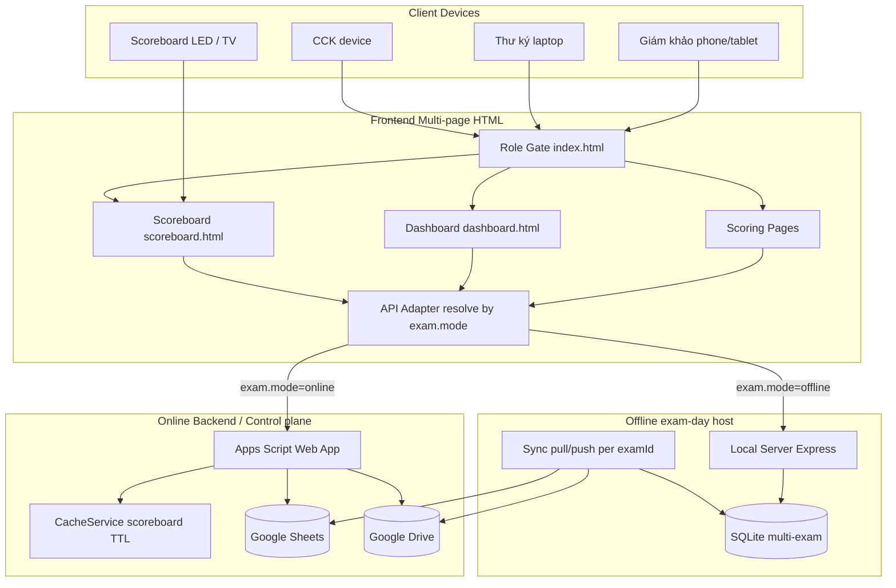
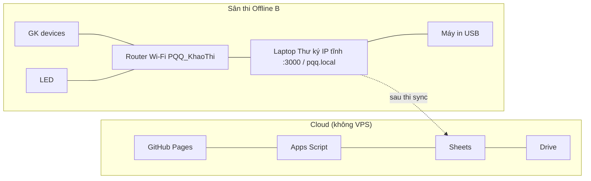
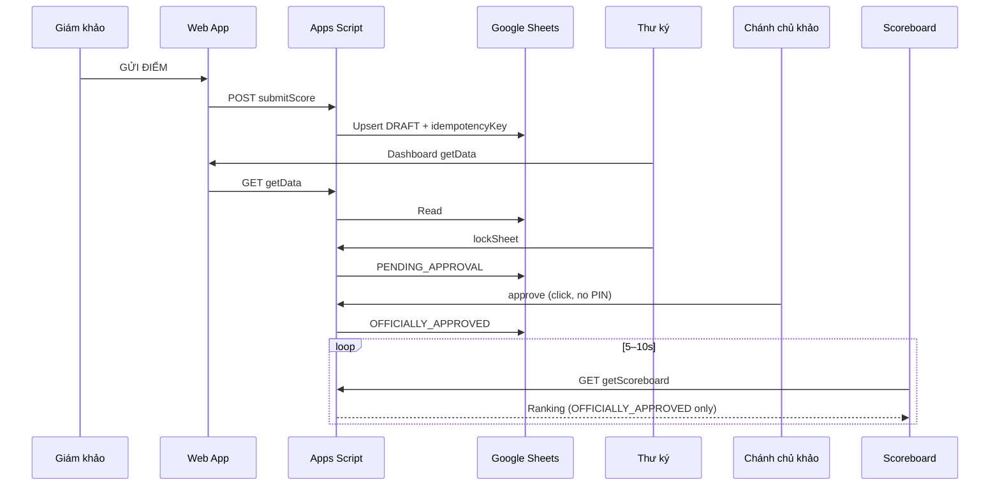

# 02 — System Design

> **Trạng thái: REQUIREMENT_FREEZE** — Mọi quyết định đã chốt tại [DECISIONS.md](./DECISIONS.md). Không thay đổi spec mà không qua Change Request.

**Source of Truth:** `QUY-TRINH-THI-ONLINE-PQQ.md`, `PHUONG-AN-B-LAN.md`

---

## 4. System Architecture

### 4.0 Nghiệp vụ gốc (exam-centric)

```text
System → Admin tạo kỳ thi → Chọn Online | Offline → Lưu exam.mode → Kỳ sẵn sàng sử dụng
```

| Khái niệm | Định nghĩa |
|---|---|
| **`exam.mode`** | Thuộc tính kỳ thi (`online` \| `offline`), do Admin chọn lúc tạo |
| **Control plane** | Admin tạo/cấu hình kỳ — luôn Apps Script / Sheets |
| **Data plane ngày thi** | Backend theo `exam.mode` của kỳ đang chọn — **không** theo hostname |
| **Local Server** | Thành phần host ngày thi cho kỳ `mode=offline`; Thư ký host; **không** tạo kỳ |

Một hệ thống quản lý nhiều kỳ: kỳ A Online, kỳ B Offline, kỳ C Online — cùng tồn tại.

### 4.1 High Level Architecture

Một Frontend multi-page HTML; backend **theo kỳ thi**:

```text
                    Admin tạo kỳ (control plane)
                              │
                    settings.mode = online | offline
                              │
         ┌────────────────────┴────────────────────┐
         ▼                                         ▼
   exam.mode=online                         exam.mode=offline
   Apps Script → Sheets                     Local Server → SQLite
                                            (Thư ký host LAN)
                                            sync pull/push Sheets
```

| Tầng | Thành phần | Vai trò |
|---|---|---|
| Frontend | GitHub Pages + multi-page HTML/CSS/JS + PWA (+ phục vụ qua Local Server khi offline exam) | Chấm điểm, Dashboard, Scoreboard; API adapter theo **`exam.mode`** |
| API Online | Google Apps Script Web App (Anyone access — AUTH-06 A) | Validate, ghi/đọc Sheets; **tạo kỳ** |
| API Offline day | `local-server/` Node.js | Mirror Apps Script trên LAN cho kỳ offline |
| DB Online / master | Google Sheets | CSDL trung tâm + nguồn tạo kỳ |
| DB Offline day | SQLite | Snapshot + phiếu tạm tại sân (nhiều `exam_id`) |
| Storage | Google Drive | PDF, chữ ký, con dấu, media, backup |
| Auth | Role pass (FE-only hash check — AUTH-04 B) | Gate theo role + **chọn examId** |

### 4.2 Component Diagram



### 4.3 Deployment Diagram



### 4.4 Infrastructure Diagram (vai trò deploy)

| Thành phần | Deploy bởi team? | Ghi chú |
|---|---|---|
| Frontend GitHub Pages | Có | Workflow sẵn `.github/workflows/pages.yml` |
| Apps Script Web App | Có | Deploy as Web App (Anyone access) |
| Sheets template | Có | Copy theo kỳ |
| Drive folders | Có | Cấu trúc theo examId |
| Meet/Zoom/Teams | Có (tài khoản Pro) | Ngoài stack điểm |
| Local Server | Có — laptop Thư ký | npm start giờ thi; config.json + mDNS pqq.local (OFF-01 A+B) |
| VPS 24/7 | **Không** | SoT |

### 4.5 Data Flow Diagram

**Online**

```text
GK → Web App → POST Apps Script → Sheets (DRAFT)
TK → GET getData (Dashboard, requires TK/CCK role)
TK → khóa → PENDING_APPROVAL
CCK → click approve → OFFICIALLY_APPROVED
SB → Polling GET getScoreboard (public, no auth) 5–10s → LED
PDF → Drive
```

**Offline B**

```text
[Tiền kỳ] Sheets → sync/pull → SQLite
[Giờ thi] GK → Local API → SQLite → Dashboard/LED LAN
[Hậu kỳ] sync/push → Sheets/Drive
```

### 4.6 Sequence — Online submit + approve



---

## 5. Frontend Architecture

### 5.1 Tech Stack (đã chốt)

| Layer | Choice | Lý do |
|---|---|---|
| UI | HTML5 + CSS + Vanilla JS (FE-01 A) | SoT; dễ bàn giao; GH Pages |
| Structure | Multi-page HTML (FE-02 C) | Mỗi screen là file HTML riêng |
| PWA | Manifest + Service Worker | Offline shell / Local Server |
| HTTP | Fetch API | POST/GET |
| Realtime UI | `setInterval` polling | Không WebSocket |
| Hosting | GitHub Pages | Free tier |

### 5.2 Folder Structure (đã chốt — multi-page)

```text
/
├── index.html                 # Entry + role gate
├── judge-theory.html          # Chấm lý thuyết
├── judge-practice.html        # Chấm thực hành
├── judge-full.html            # Chấm đầy đủ (LT+TH)
├── dashboard.html             # Thư ký Dashboard
├── scoreboard.html            # Public Scoreboard
├── admin.html                 # Admin (+ Settings merged)
├── approve.html               # CCK duyệt
├── styles.css
├── assets/
│   └── logo-...
├── js/
│   ├── api/
│   │   ├── adapter.js         # getApiBase() — config.json (API-04 A)
│   │   ├── client.js          # fetch wrappers, envelope {ok, data, error}
│   │   └── endpoints.js
│   ├── auth/
│   │   ├── role-gate.js       # FE-only pass hash check
│   │   └── session.js         # Client-side session (examId + role + judgeType)
│   ├── features/
│   │   ├── scoring/
│   │   ├── dashboard/
│   │   ├── scoreboard/
│   │   ├── admin/
│   │   └── approval/
│   ├── services/              # Business orchestration
│   ├── repositories/          # API calls theo resource
│   └── utils/
├── config.json                # API URLs (API-04 A, OFF-01 A)
├── pwa/
│   ├── manifest.webmanifest
│   └── sw.js
├── apps-script/               # Backend Online
├── local-server/              # Backend Offline B
└── docs/
```

### 5.3 Feature Modules

| Module | Trách nhiệm |
|---|---|
| Role Gate (index.html) | Chọn role + validate pass (FE-only hash check) |
| Scoring LT/TH/Full (judge-*.html) | Form điểm + GỬI ĐIỂM |
| Dashboard (dashboard.html) | Rà soát + khóa phiếu + (Offline) nút ĐỒNG BỘ |
| Approval (approve.html) | CCK click approve (không PIN) |
| Scoreboard (scoreboard.html) | Polling getScoreboard + ranking UI + Thủ khoa + motion animations |
| Admin (admin.html) | Tạo kỳ / GK list / sinh pass / Settings (FE-05 A: merged) |

### 5.4 Routing (multi-page — FE-02 C)

| File | Role | Ghi chú |
|---|---|---|
| `index.html` | All | Chọn role → redirect tới page tương ứng |
| `judge-theory.html` | GK theory | |
| `judge-practice.html` | GK practice | |
| `judge-full.html` | GK both | |
| `dashboard.html` | Thư ký | getData (full) |
| `approve.html` | CCK | Click approve |
| `scoreboard.html` | Public | getScoreboard (public, no auth) |
| `admin.html` | Admin | + Settings merged |

Không cần hash/path router — navigation qua `window.location` / links.

### 5.5 State Management

- Session: `sessionStorage` cho `examId`, `role`, `judgeId`, `judgeType` — client-side only (không server session endpoint).
- Mỗi page đọc session khi load; redirect về `index.html` nếu thiếu.
- UI state theo trang (module-level); không framework store.

### 5.6 API / Repository / Service Layers

```text
UI → Service (validate form, build payload) → Repository → api/client → adapter(API_BASE)
```

Adapter (exam.mode — không theo hostname):

```javascript
// Backend theo thuộc tính kỳ thi đã chọn
function resolveApiBase(examMode) {
  if (examMode === 'offline') {
    return config.localApiBase || ''; // same-origin khi Thư ký host Local Server
  }
  return config.onlineApiUrl; // Apps Script
}
```

Control-plane Admin (`createExamRoom`, import, …) luôn gọi `onlineApiUrl`.
### 5.7 PWA / Service Worker / Local Storage

| Hạng mục | Chiến lược (SoT) |
|---|---|
| Precache | App shell (HTML/CSS/JS/assets) |
| Runtime | Cache-first asset tĩnh |
| API | Network-only tới Apps Script hoặc Local Server |
| Cấm | Fallback lưu điểm vào localStorage |

### 5.8 Error Handling & Responsive

- Retry submit giữ nguyên `idempotencyKey`.
- Hiển thị trạng thái mạng / health Local trước giờ thi.
- Responsive bắt buộc Mobile/Tablet/Laptop.
- Error toast + disable double-submit.
- Browser support: Chrome Android + Safari iOS latest + Chrome desktop (FE-03 A).
- Accessibility: best-effort (FE-04 B).

### 5.9 Reusable Components

- Role gate card, password field, score inputs P1–P3 (range 0–10 step 0.5), status badge, student picker, polling banner, sync button (Offline).

---

## 6. Backend Architecture

### 6.1 Online — Google Apps Script

```text
apps-script/
├── Code.gs                 # doPost / doGet entry
├── Auth.gs                 # pass hash verify (FE-only gate; API trusts role from payload)
├── Scores.gs               # submit / lock / approve (no PIN)
├── Scoreboard.gs           # getScoreboard (public) + cache TTL
├── Dashboard.gs            # getData (full, TK/CCK/Admin)
├── ExamAdmin.gs            # tạo room, sinh pass, generateQrLinks
├── Pdf.gs                  # Docs → PDF → Drive
├── Validation.gs
├── SheetsRepository.gs
└── appsscript.json
```

| Layer | Nội dung |
|---|---|
| API | `doPost` action router; `getData` (Dashboard); `getScoreboard` (public) |
| Services | Score, Approval (no PIN), Scoreboard, Admin, PDF |
| Repository | Đọc/ghi Sheets theo tab |
| Validation | Required fields, status transition, totals (backend auto-calc) |
| Security | Pass hash (SHA-256+salt); Apps Script Anyone access (AUTH-06 A); Least privilege ACL (AUTH-07 A) |
| Cache | `CacheService` TTL only (DB-07 B) — scoreboard keys |

### 6.2 Offline — Local Server

```text
local-server/
├── package.json
├── server.js
├── db/schema.sql
├── sync/pull-from-sheets.js  # Service account (OFF-02 A)
├── sync/push-to-sheets.js
├── config.example.json        # API URLs + mDNS config
└── README.md
```

| Layer | Nội dung |
|---|---|
| API | Mirror: health, submitScore, getData, getScoreboard, lockSheet, approve, sync/* |
| Services | Giống Online về business rules |
| Repository | SQLite |
| Sync | Pull snapshot (service account); push upsert + conflict; LockService for all Sheets writes (OFF-03 A) |
| Security | FE-only pass gate; Wi-Fi riêng (ops); HTTP LAN + private SSID (AUTH-08 A) |

### 6.3 Sync Layer Rules (SoT)

- Upsert theo `idempotencyKey` / `scoreKey`.
- Nếu Sheets đã `PENDING_APPROVAL` / `OFFICIALLY_APPROVED` → reject hoặc `NEEDS_REVIEW`.
- Khác `payloadHash` → conflict record, không overwrite.
- `NEEDS_REVIEW` chỉ xuất hiện trong Offline sync path (AP-03).

---

## Design Decisions Locked by SoT

1. Polling, không WebSocket.
2. Mirror API contract Online ↔ Offline.
3. Local Server = production path Offline B.
4. PDF visual signature (ảnh), không crypto trừ khi bổ sung.
5. Chi phí infra ≈ 0; không VPS 24/7.
6. Multi-page HTML, không SPA router (FE-02 C).
7. FE-only auth, không server loginRole (AUTH-04 B).
8. Không PIN — CCK duyệt bằng click (AP-02).
9. Two endpoints: getData (Dashboard) + getScoreboard (public) — AUTH-09 B.
