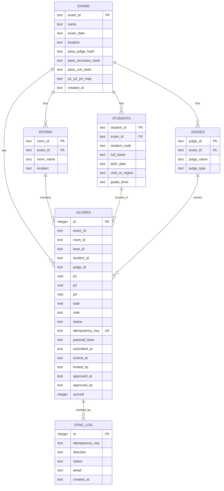

# 03 — Database Design

> **Trạng thái: REQUIREMENT_FREEZE** — Mọi quyết định đã chốt tại [DECISIONS.md](./DECISIONS.md). Không thay đổi spec mà không qua Change Request.

**Source of Truth:** `QUY-TRINH-THI-ONLINE-PQQ.md`, `PHUONG-AN-B-LAN.md`  
**Schema chính thức:** `local-server/db/schema.sql` (DB-03 A).

---

## Naming Convention

| Hệ | Quy ước (đã chốt DB-01 A) |
|---|---|
| Google Sheets tab | `UPPER_SNAKE_CASE` tiếng Anh (vd `STUDENTS`, `SCORES`) |
| Sheets cột header | `UPPER_SNAKE_CASE` tiếng Anh |
| SQLite table | `snake_case` số nhiều (`students`, `scores`, `rooms`) |
| SQLite column | `snake_case` |
| Keys nghiệp vụ | `examId`, `roomId`, `boutId`, `studentId`, `judgeId` (camelCase trong JSON API) |
| idempotency | `examId|roomId|boutId|studentId|judgeId` (theo SoT payload) |
| boutId | `studentId+round` (vd `VS-xxx|R1`) — SCORE-05 C |

---

## Google Sheets Design

### Tabs (đã chốt)

| Tab | Mục đích | Trạng thái |
|---|---|---|
| `EXAM_CONFIG` | Cấu hình kỳ thi, pass hash, P1/P2/P3 map config | ĐÃ CHỐT |
| `JUDGES` | Danh sách giám khảo + loại chấm | ĐÃ CHỐT |
| `STUDENTS` | Danh sách võ sinh | ĐÃ CHỐT |
| `SCORES` | Phiếu điểm + trạng thái (MVP columns only — DB-02 B) | ĐÃ CHỐT |

> Không có tab `SYNC_META` (chỉ dùng CacheService TTL — DB-07 B).  
> Không có tab `AUDIT_LOG` (dùng sync_log + timestamp fields trên scores — DB-05 C).  
> PDF columns (pdfUrl, pdfGeneratedAt, pdfHash) là follow-up sau MVP (DB-02 B).

### Cột nhìn thấy trên ảnh (chính thức từ SoT)

| Cột | Ý nghĩa |
|---|---|
| STT | Số thứ tự |
| Võ sinh | Họ tên |
| P1, P2, P3 | Phần điểm thành phần (map configurable per exam — SCORE-01 B) |
| Tổng | Backend auto-tính P1+P2+P3 (SCORE-03 B) |
| Trạng thái | `DRAFT` → `PENDING_APPROVAL` → `OFFICIALLY_APPROVED` |

### `SCORES` — cột chính thức (SoT + payload, MVP only — DB-02 B)

| Column | Type | Required | Ghi chú |
|---|---|---|---|
| STT | number | — | Ảnh |
| EXAM_ID | string | YES | Payload |
| ROOM_ID | string | YES | Payload |
| BOUT_ID | string | YES | = studentId+round (SCORE-05 C) |
| STUDENT_ID | string | YES | Payload |
| STUDENT_CODE | string | NO | Payload sample |
| STUDENT_NAME | string | YES | Payload / ảnh |
| JUDGE_ID | string | YES | Payload |
| JUDGE_NAME | string | YES | Payload |
| P1 | number (0–10 step 0.5) | YES* | Payload / ảnh |
| P2 | number (0–10 step 0.5) | YES* | Payload / ảnh |
| P3 | number (0–10 step 0.5) | YES* | Payload / ảnh |
| TOTAL | number | YES | Backend auto-calc (SCORE-03 B) |
| NOTE | string | NO | Payload |
| STATUS | enum | YES | SoT |
| IDEMPOTENCY_KEY | string | YES | Payload |
| CLIENT_REQUEST_ID | string | NO | Payload Online sample |
| SUBMITTED_AT | datetime ISO | YES | Payload |
| APP_VERSION | string | NO | Payload |
| LOCKED_AT | datetime | NO | Timestamp khi khóa (DB-05 C) |
| LOCKED_BY | string | NO | DB-05 C |
| APPROVED_AT | datetime | NO | Timestamp khi approve (DB-05 C) |
| APPROVED_BY | string | NO | DB-05 C |
| PAYLOAD_HASH | string | NO | Conflict sync SoT |
| NEEDS_REVIEW | boolean | NO | Chỉ Offline sync path (AP-03) |

\* YES theo phần được phép chấm (LT/TH) — map configurable per exam (SCORE-01 B).

> PDF columns (`PDF_URL`, `PDF_GENERATED_AT`, `PDF_HASH`) sẽ thêm sau MVP (DB-02 B).

### `STUDENTS` — tối thiểu SoT

| Field | Mô tả |
|---|---|
| Mã võ sinh | Unique trong kỳ |
| Họ tên | Hiển thị |
| Ngày sinh | Đối chiếu |
| CLB / Đơn vị / Miền | Scoreboard "Miền" |
| Cấp thi | Cấp đai |

### `EXAM_CONFIG` — đã chốt

| Field | Mô tả |
|---|---|
| examId, name, date, location, type | Tiền kỳ SoT |
| pass_judge_hash, pass_secretary_hash, pass_cck_hash | 3 pass kỳ (SHA-256+salt — AUTH-01 A) |
| pass_admin_hash | Cố định toàn hệ |
| p1_p2_p3_map | Map P1/P2/P3 ↔ LT/TH configurable per exam (SCORE-01 B) |
| judges_count / settings | Cấu hình GK |

> Không có `pin_cck_hash` / `pin_salt` — PIN đã bỏ (AP-02).

### Relationships (logical)

```text
EXAM_CONFIG 1──* ROOMS
EXAM_CONFIG 1──* STUDENTS
EXAM_CONFIG 1──* JUDGES
EXAM_CONFIG 1──* SCORES
STUDENT 1──1 SCORES (1 score per student — SB-02)
JUDGE 1──* SCORES
```

---

## SQLite Design (Offline B)

SoT nêu bảng: `students`, `judges`, `scores`, `rooms`, `sync_log`.  
File `local-server/db/schema.sql` là schema chính thức (DB-03 A).

### ER Diagram



### Tables & Constraints (chính thức — DB-03 A)

```sql
PRAGMA foreign_keys = ON;

CREATE TABLE exams (
  exam_id TEXT PRIMARY KEY,
  name TEXT NOT NULL,
  exam_date TEXT,
  location TEXT,
  pass_judge_hash TEXT NOT NULL,
  pass_secretary_hash TEXT NOT NULL,
  pass_cck_hash TEXT NOT NULL,
  p1_p2_p3_map TEXT,
  created_at TEXT NOT NULL
);

CREATE TABLE rooms (
  room_id TEXT NOT NULL,
  exam_id TEXT NOT NULL,
  room_name TEXT,
  location TEXT,
  PRIMARY KEY (exam_id, room_id),
  FOREIGN KEY (exam_id) REFERENCES exams(exam_id)
);

CREATE TABLE students (
  student_id TEXT NOT NULL,
  exam_id TEXT NOT NULL,
  student_code TEXT,
  full_name TEXT NOT NULL,
  birth_date TEXT,
  club_or_region TEXT,
  grade_level TEXT,
  PRIMARY KEY (exam_id, student_id),
  FOREIGN KEY (exam_id) REFERENCES exams(exam_id)
);

CREATE TABLE judges (
  judge_id TEXT NOT NULL,
  exam_id TEXT NOT NULL,
  judge_name TEXT NOT NULL,
  judge_type TEXT NOT NULL CHECK (judge_type IN ('theory','practice','both')),
  PRIMARY KEY (exam_id, judge_id),
  FOREIGN KEY (exam_id) REFERENCES exams(exam_id)
);

CREATE TABLE scores (
  id INTEGER PRIMARY KEY AUTOINCREMENT,
  exam_id TEXT NOT NULL,
  room_id TEXT NOT NULL,
  bout_id TEXT NOT NULL,
  student_id TEXT NOT NULL,
  student_name TEXT,
  judge_id TEXT NOT NULL,
  judge_name TEXT,
  p1 REAL CHECK (p1 >= 0 AND p1 <= 10),
  p2 REAL CHECK (p2 >= 0 AND p2 <= 10),
  p3 REAL CHECK (p3 >= 0 AND p3 <= 10),
  total REAL NOT NULL,
  note TEXT,
  status TEXT NOT NULL CHECK (status IN (
    'DRAFT','PENDING_APPROVAL','OFFICIALLY_APPROVED','NEEDS_REVIEW'
  )),
  idempotency_key TEXT NOT NULL UNIQUE,
  client_request_id TEXT,
  payload_hash TEXT,
  submitted_at TEXT NOT NULL,
  locked_at TEXT,
  locked_by TEXT,
  approved_at TEXT,
  approved_by TEXT,
  synced_to_cloud INTEGER NOT NULL DEFAULT 0,
  FOREIGN KEY (exam_id) REFERENCES exams(exam_id),
  FOREIGN KEY (exam_id, room_id) REFERENCES rooms(exam_id, room_id)
);

CREATE TABLE sync_log (
  id INTEGER PRIMARY KEY AUTOINCREMENT,
  idempotency_key TEXT,
  direction TEXT NOT NULL CHECK (direction IN ('pull','push')),
  status TEXT NOT NULL,
  detail TEXT,
  created_at TEXT NOT NULL
);

CREATE INDEX idx_scores_exam_status ON scores(exam_id, status);
CREATE INDEX idx_scores_student ON scores(exam_id, student_id);
CREATE INDEX idx_scores_synced ON scores(synced_to_cloud);
CREATE INDEX idx_scores_room ON scores(exam_id, room_id);
```

### Indexes

| Index | Lý do |
|---|---|
| `idempotency_key UNIQUE` | Chống trùng submit/sync (SoT) |
| `(exam_id, status)` | Dashboard / scoreboard filter |
| `synced_to_cloud` | Push chỉ bản chưa sync |
| `(exam_id, room_id)` | Multi-room queries (EXAM-01 B) |

---

## Score Status Enum

```text
DRAFT → PENDING_APPROVAL → OFFICIALLY_APPROVED
                ↘ NEEDS_REVIEW (chỉ khi conflict Offline sync — AP-03)
```

`NEEDS_REVIEW` chỉ xuất hiện trong Offline sync path, không Online.

---

## Drive Folder Convention (đã chốt — DB-06 C)

```text
/ExamRoom/{examId}/{roomId}/
├── PDF_Phiếu/{studentId}/...pdf
├── signatures/                    # Ảnh chữ ký
├── seals/                         # Ảnh con dấu
├── backup/                        # (optional)
└── media/                         # (optional)
```
