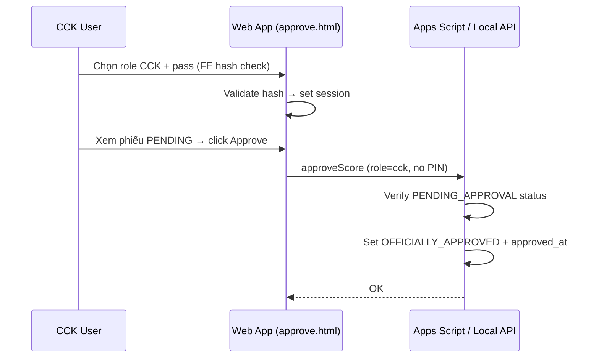

# 04 — API Design & Authentication

> **Trạng thái: REQUIREMENT_FREEZE** — Mọi quyết định đã chốt tại [DECISIONS.md](./DECISIONS.md). Không thay đổi spec mà không qua Change Request.

**Source of Truth:** `QUY-TRINH-THI-ONLINE-PQQ.md`, `PHUONG-AN-B-LAN.md`

---

## 8. API Specifications

### 8.0 Contract chung

| Nguyên tắc | Chi tiết |
|---|---|
| Mirror | Local API mirror Apps Script — cùng payload |
| Adapter | `API_BASE` theo origin; config.json cho URLs (API-04 A) |
| Online entry | Apps Script Web App `doPost` / `getData` (TK/CCK) / `getScoreboard` (public) |
| Offline entry | `/api/*` trên Local Server `:3000` |
| Idempotency | Bắt buộc trên submit / approve / sync |
| Access mode | Apps Script Anyone access (AUTH-06 A) |

**Envelope chuẩn (API-01 A):**

```json
{
  "ok": false,
  "error": {
    "code": "VALIDATION_ERROR",
    "message": "Human readable",
    "details": {}
  }
}
```

```json
{
  "ok": true,
  "data": { ... }
}
```

### 8.1 Online APIs

Apps Script thường dùng một URL `/exec` và phân nhánh bằng `action` trong body (SoT: `doPost`, `getData`).

| Action / Endpoint | Method | Mục đích | Permission |
|---|---|---|---|
| `submitScore` | POST `doPost` | Gửi điểm → `DRAFT` | Role Giám khảo (FE-gated) |
| `getData` | GET | Dashboard (full data) | TK / CCK / Admin (FE-gated) |
| `getScoreboard` | GET | Public scoreboard (ranking only) | Public — no auth (AUTH-09 B) |
| `lockSheet` | POST | → `PENDING_APPROVAL` | Thư ký (FE-gated) |
| `approve` / `approveScore` | POST | → `OFFICIALLY_APPROVED` | CCK (FE-gated, no PIN) |
| Admin tạo kỳ / sinh pass | POST | Tiền kỳ | Admin (FE-gated) |
| `generateQrLinks` | POST | Sinh QR/link (EXAM-03 B) | Admin |
| PDF generate | POST / trigger | Xuất PDF | System / Thư ký |

#### `submitScore` — Request (chính thức từ SoT)

```json
{
  "action": "submitScore",
  "examId": "PQQ-HCM-2026-008",
  "roomId": "ROOM_A",
  "boutId": "VS-000058|R1",
  "student": {
    "studentId": "VS-000058",
    "studentCode": "PQQ-058",
    "studentName": "TRAN VAN B"
  },
  "judge": {
    "judgeId": "GK-101",
    "judgeName": "NGUYEN VAN A"
  },
  "scores": {
    "P1": 7,
    "P2": 8,
    "P3": 6
  },
  "note": "Đòn kỹ thuật sạch, tinh thần ổn định.",
  "clientRequestId": "9b4c2a88-6a4f-4d7c-9c9e-7af2b1e0c6e1",
  "idempotencyKey": "PQQ-HCM-2026-008|ROOM_A|VS-000058|R1|VS-000058|GK-101",
  "submittedAt": "2026-07-16T14:37:12.123+07:00",
  "appVersion": "1.0.0"
}
```

**Validation:**

- Required: exam/room/bout/student/judge/scores/idempotencyKey/submittedAt.
- Reject nếu trạng thái hiện tại ≠ `DRAFT`.
- Trùng `idempotencyKey` → trả result cũ, không ghi thêm.
- Upsert overwrite khi DRAFT (SCORE-02 A).
- `total` = backend auto-calc P1+P2+P3 (SCORE-03 B). Client không gửi total.
- Range điểm: 0–10 step 0.5 (SCORE-04 B).
- `boutId` = `studentId+round` (vd `VS-xxx|R1`) — SCORE-05 C.

**Response:**

```json
{
  "ok": true,
  "data": {
    "status": "DRAFT",
    "idempotencyKey": "...",
    "scoreKey": "...",
    "total": 21,
    "duplicate": false
  }
}
```

#### `getData` — Dashboard (TK/CCK/Admin only)

| Param | Mục đích |
|---|---|
| `examId` | Kỳ thi |
| `roomId` | Nếu chia bảng |
| `role` | FE gửi role from session |

Full data: tất cả phiếu điểm + trạng thái + student info.

#### `getScoreboard` — Public ranking (AUTH-09 B)

| Param | Mục đích |
|---|---|
| `examId` | Kỳ thi |
| `roomId` | (optional) |

Response: top N ranking, chỉ phiếu `OFFICIALLY_APPROVED` (SB-01 B).  
Tiebreak: highest total → highest single column → lowest column (SB-03).

#### `lockSheet` — Request

```json
{
  "action": "lockSheet",
  "examId": "...",
  "roomId": "...",
  "boutId": "...",
  "studentId": "...",
  "session": { "role": "secretary" }
}
```

Effect: `DRAFT` → `PENDING_APPROVAL`. Sets `locked_at`, `locked_by`.

#### `approve` / `approveScore` — Request (không PIN — AP-02)

```json
{
  "action": "approveScore",
  "examId": "...",
  "targets": [{ "idempotencyKey": "..." }],
  "approveIdempotencyKey": "...",
  "session": { "role": "cck" }
}
```

Rules:

1. Chỉ role CCK (FE-gated).
2. Chỉ khi `PENDING_APPROVAL`.
3. Sets `approved_at`, `approved_by`.
4. Idempotency approve.
5. Không PIN — CCK đã login bằng pass cố định (AP-02).

### 8.2 Offline Local APIs

| Endpoint | Method | Mục đích |
|---|---|---|
| `/api/health` | GET | Server sống |
| `/api/submitScore` | POST | → `DRAFT` |
| `/api/getData` | GET | Dashboard (full) |
| `/api/getScoreboard` | GET | Public ranking |
| `/api/lockSheet` | POST | → `PENDING_APPROVAL` |
| `/api/approve` | POST | → `OFFICIALLY_APPROVED` |
| `/api/sync/pull` | POST | Snapshot Sheets → SQLite |
| `/api/sync/push` | POST | Upsert SQLite → Sheets (+ Drive PDF) |

Payload `submitScore` **giống Online**.

### 8.3 Sync APIs

#### `POST /api/sync/pull`

- Input: `examId` (+ service account credentials — OFF-02 A).
- Output: số bản ghi students/judges/rooms/config đã seed.
- Tiền kỳ bắt buộc Offline B.
- LockService for Sheets writes (OFF-03 A).

#### `POST /api/sync/push`

- Upsert theo `idempotencyKey`.
- Conflict khác `payloadHash` → `NEEDS_REVIEW`, không overwrite.
- Sheets đã khóa/duyệt → reject hoặc `NEEDS_REVIEW`.
- `NEEDS_REVIEW` chỉ Offline sync path (AP-03).
- LockService for all Sheets writes (OFF-03 A).

### 8.4 Authentication

| Item | Decision |
|---|---|
| FE-only pass check (AUTH-04 B) | FE validates pass hash client-side to gate UI. Không server loginRole endpoint. |
| Session = client-side | `sessionStorage`: examId + role + judgeType/judgeId. Không server session. |
| Hash algorithm | SHA-256 + salt (AUTH-01 A) |
| API trusts role | API trusts role from payload (AUTH-04 B). |
| Apps Script access | Anyone (AUTH-06 A) |
| ACL | Least privilege Sheets/Drive (AUTH-07 A) |
| OAuth2 | Không (AUTH-05 A) |
| Offline network | HTTP LAN + private SSID (AUTH-08 A) |
| Rate limit sai pass | Không lockout (AP-01) |

### 8.5 Admin APIs

| Action | Mô tả |
|---|---|
| `createExamRoom` | Tạo Folder + copy template Sheets (EXAM-04 C: docs 03 schema as template) |
| `importStudents` | Bulk students |
| `configureJudges` | Thêm/bớt GK + type |
| `rotateRolePasswords` | Sinh 3 pass; không đụng Admin |
| `generateQrLinks` | Script/API sinh QR links (EXAM-03 B) |

Full Admin UI on Web App (EXAM-02 B).

### 8.6 Error Codes (đã chốt — API-02 A)

| Code | Khi nào |
|---|---|
| `VALIDATION_ERROR` | Thiếu/sai field |
| `UNAUTHORIZED` | Sai pass/session |
| `FORBIDDEN` | Sai role |
| `INVALID_STATUS_TRANSITION` | Submit khi đã khóa; approve khi chưa PENDING |
| `DUPLICATE_IDEMPOTENT` | Trùng key — trả bản cũ (có thể `ok: true`) |
| `CONFLICT_NEEDS_REVIEW` | Sync conflict (Offline only) |
| `QUOTA_EXCEEDED` | Apps Script limit |
| `SERVER_UNAVAILABLE` | Local health fail |

### 8.7 Rate Limits

| Surface | Policy |
|---|---|
| Sai pass role | Không lockout (AP-01) |
| Scoreboard polling | Cache TTL CacheService (DB-07 B); conservative design poll 10s cache 20s (DEP-04 B); jitter ±1.5s |
| submitScore retry | Cho phép retry cùng idempotencyKey |

### 8.8 Permissions Matrix

| API | GK | TK | CCK | Admin | Public SB |
|---|---|---|---|---|---|
| submitScore | ✓ | — | — | — | — |
| getData (full) | — | ✓ | ✓ | ✓ | — |
| getScoreboard (ranking) | — | — | — | — | ✓ |
| lockSheet | — | ✓ | — | — | — |
| approve | — | — | ✓ | — | — |
| sync/* | — | ✓ | — | ✓ | — |
| createExam | — | — | — | ✓ | — |

Two separate endpoints: `getData` (Dashboard) + `getScoreboard` (public) — AUTH-09 B.

---

## 9. Authentication Design

### 9.1 Role Gate Flow (đã chốt)

```text
Mở Web App (index.html) → CHỌN ROLE
  Scoreboard → redirect scoreboard.html ngay
  Giám khảo → pass GK (FE hash check) → chọn LT|TH|Cả hai → redirect judge-*.html
  Thư ký → pass TK (FE hash check) → redirect dashboard.html
  CCK → pass CCK (FE hash check) → redirect approve.html
  Admin → pass Admin cố định (FE hash check) → redirect admin.html
→ Session client-side: examId + role (+ judgeType/judgeId) in sessionStorage
```

### 9.2 CCK Approval Flow (không PIN — AP-02)



### 9.3 Security Strategy (đã chốt)

- Hash pass SHA-256 + salt (AUTH-01 A); FE-only check (AUTH-04 B).
- Không rate limit lockout (AP-01).
- Không PIN (AP-02).
- Không OAuth2 (AUTH-05 A).
- Offline: Wi-Fi kỳ thi riêng, HTTP LAN + private SSID (AUTH-08 A).
- Apps Script access mode: Anyone (AUTH-06 A).
- Least privilege Sheets/Drive ACL (AUTH-07 A).
- Scoreboard chỉ dữ liệu `OFFICIALLY_APPROVED`.
- LAN Local Server không expose ra Internet.
