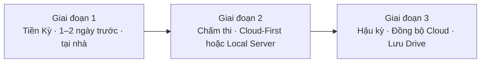
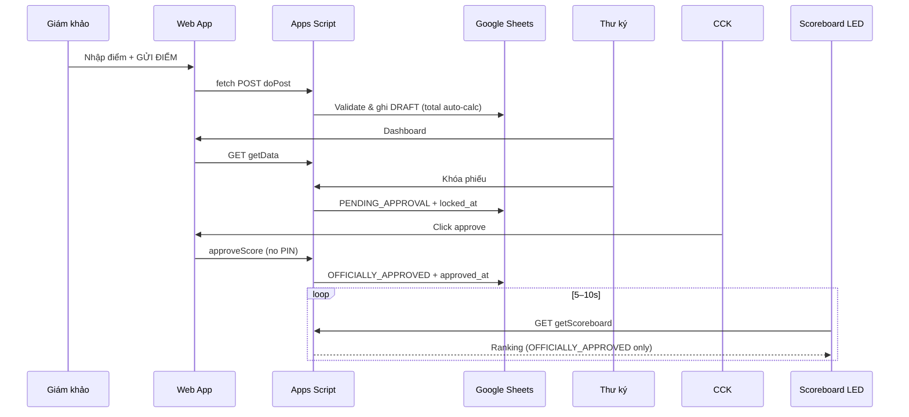
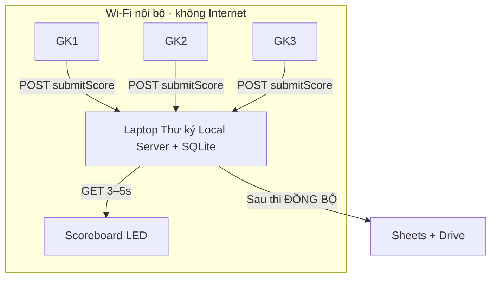
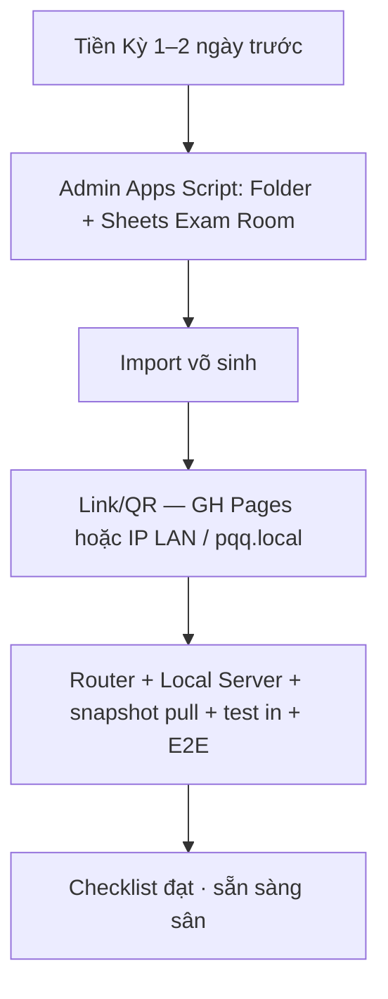
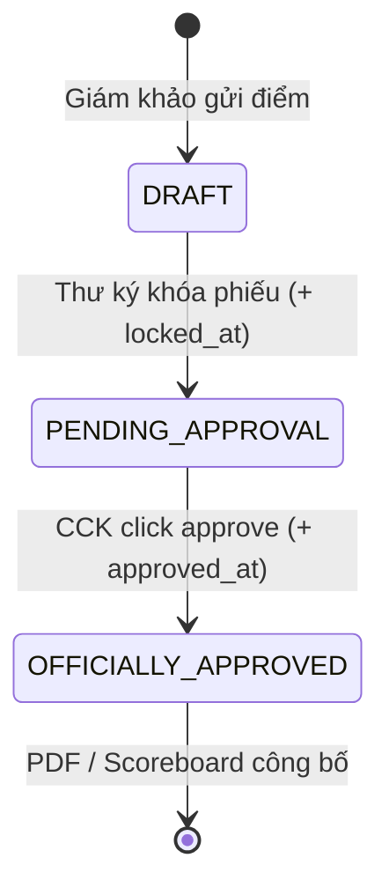
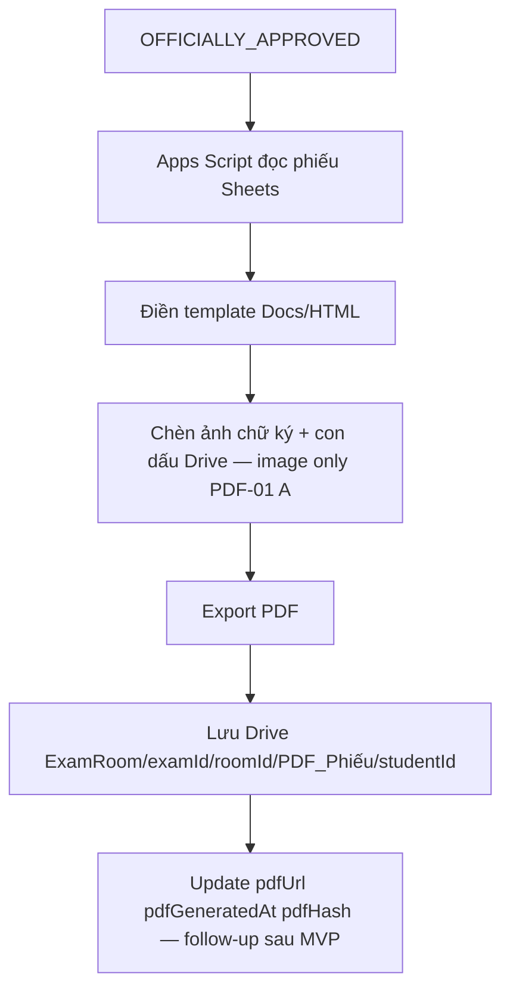
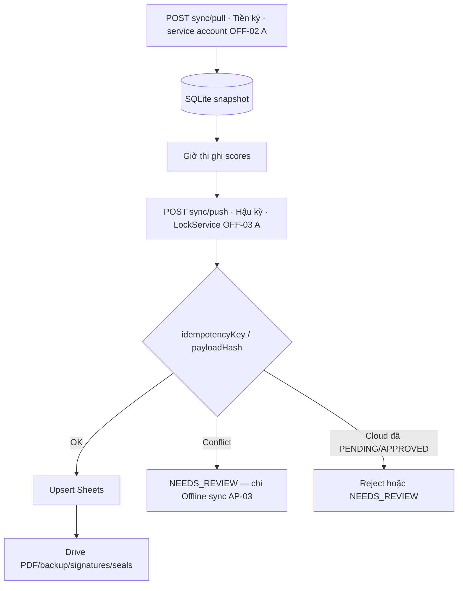
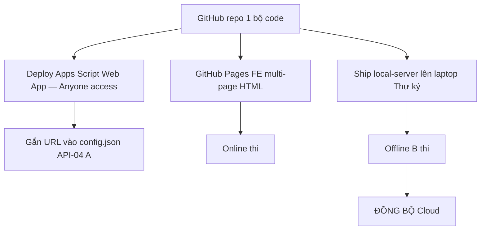
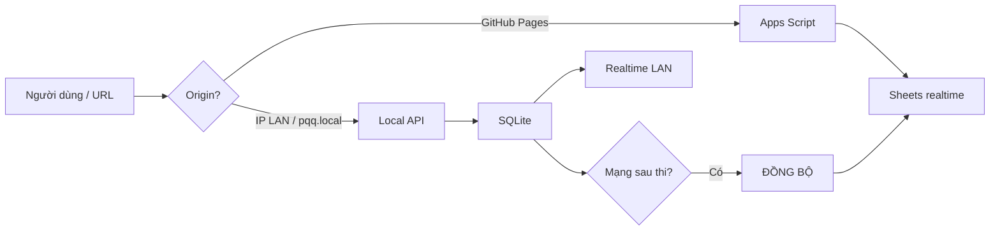

# 05 — Workflow Design

> **Trạng thái: REQUIREMENT_FREEZE** — Mọi quyết định đã chốt tại [DECISIONS.md](./DECISIONS.md). Không thay đổi spec mà không qua Change Request.

**Source of Truth:** mọi workflow trong `QUY-TRINH-THI-ONLINE-PQQ.md` + `PHUONG-AN-B-LAN.md` — không bỏ sót macro flow.

---

## Macro: 3 giai đoạn



---

## 10.1 Online Workflow (3 miền Live)

### Bước vận hành tại sân

1. **Setup Video** (song song): Meet/Zoom/Teams · 3 điểm cầu + Tổ đình · camera toàn/cận cảnh · âm thanh 2 chiều · LED.
2. **Chấm điểm**
   - GK: Web App → GỬI ĐIỂM → Apps Script → Sheets `DRAFT`.
   - TK: Dashboard GET getData → Khóa phiếu → `PENDING_APPROVAL`.
   - CCK: xem + click approve → `OFFICIALLY_APPROVED` (không PIN).
3. **Scoreboard**: polling GET getScoreboard (public) 5–10s · chỉ OFFICIALLY_APPROVED · Hạng/Võ sinh/Miền/Tổng · Thủ khoa + motion animations.
4. **Hậu kỳ**: PDF · in · Drive (điểm đã realtime trên Sheets).



---

## 10.2 Offline Workflow

### Phương án A — Hotspot 4G (dự phòng)

- Điện thoại phát hotspot → thiết bị kết nối → **giống Online** (Apps Script).
- Không Local Server.

### Phương án B — LAN Local Server (chính)

Xem chi tiết PA-B.



Luồng nghiệp vụ giữ nguyên: **GỬI ĐIỂM → DRAFT → Khóa → CCK click approve → OFFICIALLY_APPROVED**.

---

## 10.3 Local Server Workflow (Tiền kỳ → Giờ thi → Hậu kỳ)

### Tiền kỳ (có Internet, tại nhà)



Checklist kết quả Tiền kỳ (SoT):

- [ ] Phòng thi (Folder + Sheets) đã tạo
- [ ] Danh sách võ sinh import đủ
- [ ] Link/QR sẵn sàng (EXAM-03 B: generateQrLinks)
- [ ] Router + Local Server + máy in đã test *(bắt buộc Offline B)*

### Trong giờ thi

1. Thư ký bật router + `npm start` Local Server.
2. GK join Wi-Fi `PQQ_KhaoThi` → QR `http://pqq.local:3000` hoặc `http://192.168.1.100:3000`.
3. GỬI ĐIỂM → SQLite `DRAFT`.
4. Dashboard / LED poll Local 3–5s.
5. Khóa phiếu → CCK click approve → Approved.
6. Xuất PDF, in USB tại sân (nếu cần).

### Hậu kỳ

1. Có 4G/Wi-Fi.
2. Nút **ĐỒNG BỘ** / `POST /api/sync/push`.
3. Upsert Sheets + PDF/backup Drive.

---

## 10.4 Approval Workflow (không PIN — AP-02)



Frontend sau khóa:

- Disable input + nút GỬI ĐIỂM nếu status ≥ `PENDING_APPROVAL`.
- Backend vẫn enforce reject submit.
- CCK duyệt bằng click (pass role CCK cố định, không PIN riêng).

---

## 10.5 PDF Workflow



- Online: trigger sau approve.
- Offline: sau sync lên Sheets (và/hoặc in tại sân trước sync).
- Chữ ký cryptographic: **ngoài scope** (PDF-01 A: image only).

---

## 10.6 Export Workflow (in ấn tại chỗ)

```text
Web App duyệt kết quả
  → Xuất PDF
  → Máy in USB (laptop Thư ký)
  → Thầy Chưởng Môn ký & đóng dấu bản giấy
```

---

## 10.7 Sync Workflow



---

## 10.8 Deployment Workflow



Switch mode:



---

## 10.9 Role Gate Workflow (đã chốt — FE-only auth)

```text
Mở Web App (index.html)
 → CHỌN ROLE
      Scoreboard → redirect scoreboard.html ngay
      Giám khảo → pass (FE hash check) → theory|practice|both → redirect judge-*.html
      Thư ký → pass (FE hash check) → redirect dashboard.html
      CCK → pass (FE hash check) → redirect approve.html
      Admin → pass cố định (FE hash check) → redirect admin.html
 → Session client-side: examId + role (+ judgeType/judgeId) in sessionStorage
```

Pass lưu hash Sheets (Online) / SQLite (Offline). FE-only check (AUTH-04 B).

---

## 10.10 Edge Cases (SoT PHẦN 3)

| Case | Xử lý |
|---|---|
| Online mạng chập chờn | Retry cùng `idempotencyKey` |
| Sync conflict Offline | `NEEDS_REVIEW` (chỉ Offline — AP-03); CCK chọn attempt đúng |
| Laptop/router Offline | USB backup, laptop dự phòng, test trước (PA-B) |
| Sai pass nhiều lần | Không lockout (AP-01) |

---

## Chọn phương án tại sân (Sau Tiền kỳ)

| Điều kiện | Phương án |
|---|---|
| 4G/Wi-Fi ổn định | A Cloud-First (Online) |
| Mất sóng / sóng yếu | B LAN Local Server |
