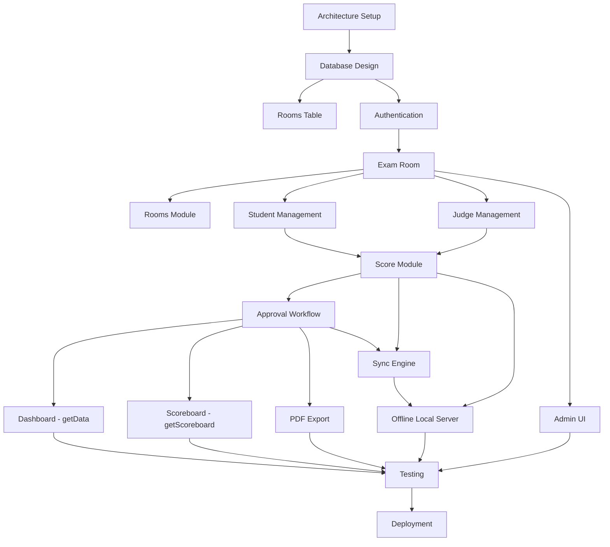

# 10 — Dependency Map

> **Trạng thái: REQUIREMENT_FREEZE** — Mọi quyết định đã chốt tại [DECISIONS.md](./DECISIONS.md). Không thay đổi spec mà không qua Change Request.

---

## 17. Module Dependency Map

```text
Architecture Setup / Repo Scaffold
        ↓
Database Design (Sheets template + SQLite schema + rooms table)
        ↓
Authentication (Role gate + pass hashes; FE-only check)
        ↓
Exam Room (create Folder + Sheets)
        ↓
        ├── Rooms (multi-room support)
Student Management  ←→  Judge Management     (song song sau Exam Room)
        ↓
Score Module (submitScore + idempotency)
        ↓
Approval Workflow (lock → CCK approve)
        ↓
        ├── Dashboard (phụ thuộc Score + Approval) — getData endpoint
        ├── Scoreboard (APPROVED only) — getScoreboard endpoint
        └── PDF Export (phụ thuộc OFFICIALLY_APPROVED)
        ↓
Sync Engine (cần Score contract ổn định)
        ↓
Offline Mode / Local Server (mirror + SQLite + serve FE)
        ↓
Admin UI (parallel with Phase 2+; full web UI)
        ↓
Testing (unit → integration → sync → E2E → LAN drill)
        ↓
Deployment (Pages + Apps Script + runbooks + rehearsal)
```

### Graph (Mermaid)



---

## Phụ thuộc chính

| Module | Phụ thuộc trực tiếp | Phải làm trước |
|---|---|---|
| Authentication | DB hashes / exam config | Database |
| Exam Room | Auth Admin | Auth |
| Rooms | Exam Room | Exam Room |
| Students / Judges | Exam Room | Exam Room |
| Score | Students, Judges, Auth GK | Students+Judges |
| Approval | Score, Auth TK/CCK | Score |
| Dashboard | Score, Approval | Approval APIs |
| Scoreboard | getScoreboard (APPROVED only) | Score+Approval |
| PDF | Approved scores, Drive | Approval |
| Sync | Score schema + Sheets | Score + DB |
| Offline Local Server | API contract Score/Approval + Sync | Score+Approval ổn định |
| Admin UI | Exam Room, Auth, Rooms | Auth (parallel with Score) |
| Testing | Features tương ứng | Theo từng milestone |
| Deployment | Passing tests + runbooks | Testing M3/M4 |

---

## Có thể làm song song

| Nhóm song song | Điều kiện |
|---|---|
| Student Management ∥ Judge Management | Sau Exam Room |
| Scoreboard UI ∥ CacheService BE | Sau khi có getScoreboard stub |
| PDF template / Drive folder design ∥ Local Server scaffold | Sau Score contract v0 |
| Video ops runbook ∥ mọi module phần mềm | Độc lập stack điểm |
| PWA shell ∥ Auth UI | Sau Architecture |
| Admin UI ∥ Score Module | Sau Auth + Exam Room contracts |
| Risk mitigations ops (USB, router) ∥ coding Offline | Ops song song Phase 6 |

---

## Critical Path (không trì hoãn)

1. DB schema locked + schema.sql committed
2. Auth + Exam + Students/Judges
3. Score + Idempotency
4. Approval
5. Local Server mirror + Sync
6. LAN rehearsal

Scoreboard/PDF có thể trễ hơn một sprint so với critical path Online scoring, nhưng **không** được trễ hơn ngày rehearsal nếu kỳ thi thật cần LED/in phiếu.
