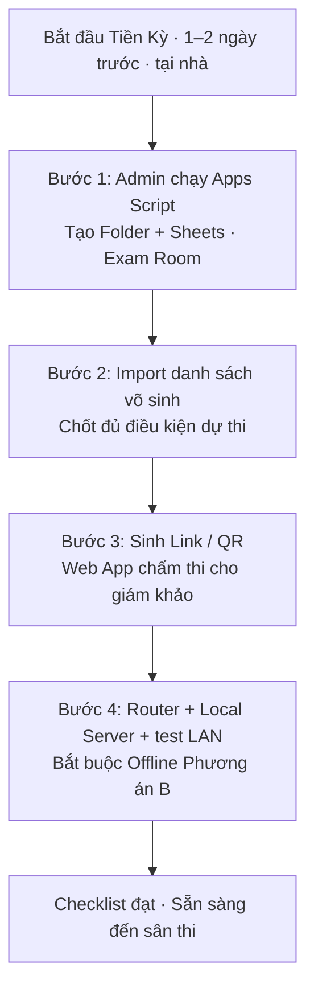
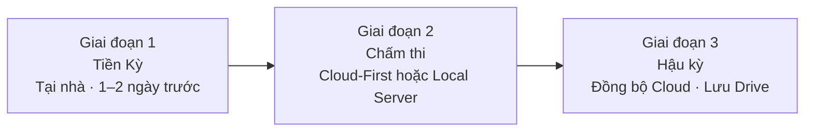
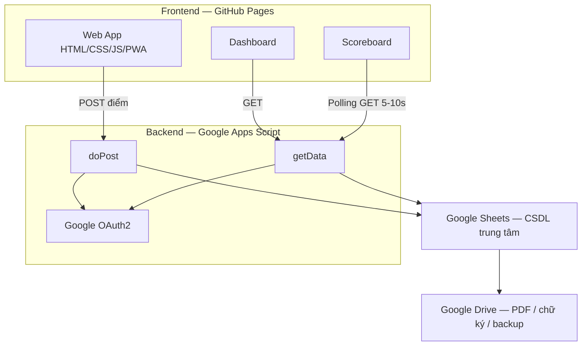
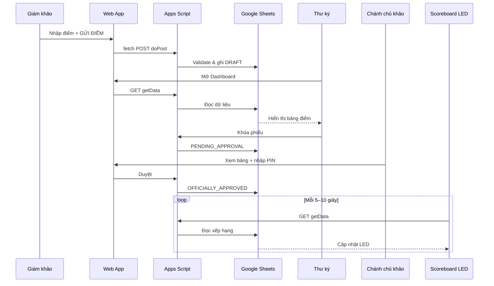
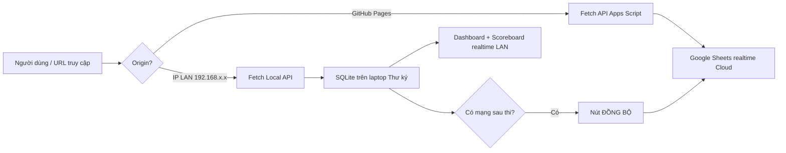
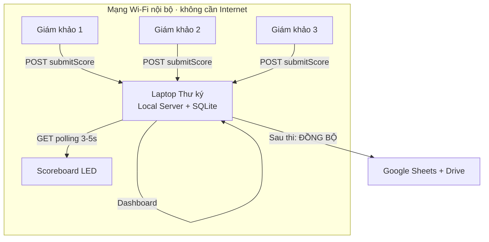
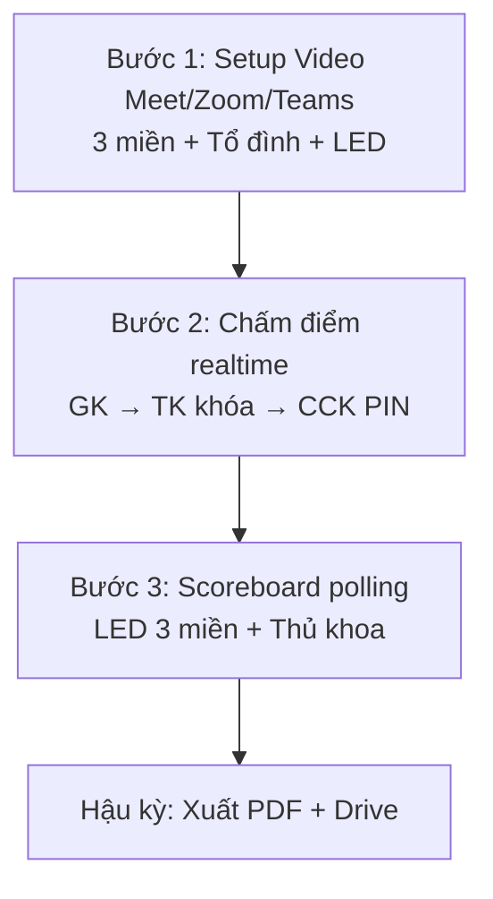
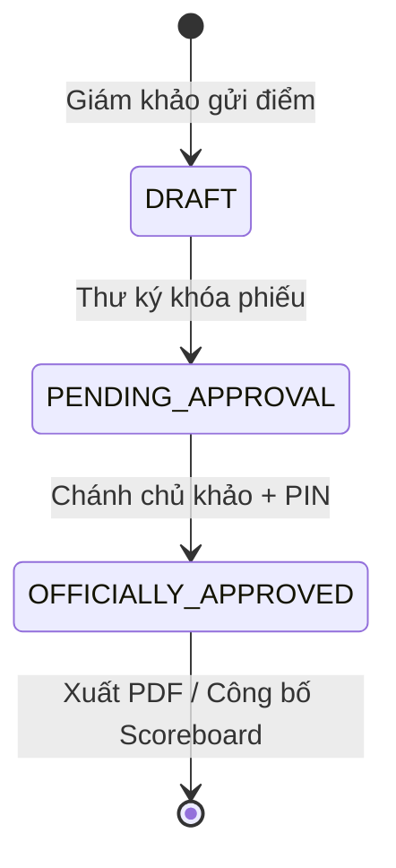

# TÀI LIỆU THIẾT KẾ HỆ THỐNG THI THĂNG ĐAI 2-TRONG-1

**Tên hệ thống:** Hệ thống thi thăng đai 2-trong-1 (Offline & 3 miền Online)  
**Tên gọi khác:** Hệ thống thi thăng đai 3 miền trực tiếp (Live Multi-Region)  
**Khẩu hiệu:** 1 bộ code – 2 kịch bản xử lý – Minh bạch – Trực quan – Gắn kết toàn môn phái  
**Workflow tối ưu:** **Chuẩn bị trước — Đồng bộ sau**  
**Nền tảng cốt lõi:** GitHub + Google Apps Script + Google Sheets + Google Drive + Web App (+ Local Server khi Offline)  
**Spec Offline B:** xem chi tiết tại [`PHUONG-AN-B-LAN.md`](./PHUONG-AN-B-LAN.md)  
**Phiên bản tài liệu:** Cập nhật theo Phương án B · LAN Local Server (realtime)  
**Đối tượng đọc:** Ban tổ chức kỳ thi, lập trình viên mới, người nhận bàn giao dự án, người trình bày proposal

---

# Tổng quan hệ thống

Hệ thống phục vụ **chấm thi thăng đai võ thuật** theo mô hình điện tử, hỗ trợ đồng thời hai loại kỳ thi trên **cùng một bộ mã nguồn**:

1. **Kỳ Online** (`exam.mode=online`) — giám khảo tại Bắc / Trung / Nam chấm qua Internet; Apps Script + Sheets; Scoreboard realtime Cloud.
2. **Kỳ Offline** (`exam.mode=offline`) — Admin đã tạo kỳ trước; ngày thi Thư ký host **Local Server** trên LAN; GK/CCK chấm realtime; sync Sheets sau khi có mạng.

**Online/Offline là thuộc tính kỳ thi do Admin chọn lúc tạo** — không phải thuộc tính của môi trường chạy app. Local Server không phải “Offline Mode toàn hệ thống”.

Người dùng truy cập qua trình duyệt trên **Mobile / Tablet / Laptop**. Giao diện trên **GitHub Pages** (Online) hoặc phục vụ qua Local Server (ngày thi Offline); ưu tiên **PWA** và responsive.

### Đối tượng sử dụng

| Đối tượng | Mục đích sử dụng |
|---|---|
| Admin | **Duy nhất** tạo kỳ thi + chọn Online/Offline; cấu hình GK/TS; sinh 3 pass; pass Admin cố định |
| Giám khảo | Chọn kỳ thi → pass GK → chấm → **GỬI ĐIỂM** (backend theo `exam.mode`) |
| Thư ký | **Không tạo kỳ.** Host Local Server cho kỳ offline; Dashboard; khóa phiếu; sync |
| Chánh chủ khảo | Chọn kỳ → pass CCK → duyệt phiếu |
| Ban tổ chức / khán giả | Scoreboard (không pass) → xếp hạng LED |

### Mục tiêu của hệ thống

- Số hóa quy trình chấm thi thăng đai.
- Cho phép tổ chức kỳ thi **3 miền cùng lúc** với dữ liệu tập trung.
- Vẫn chạy được khi **mất mạng / sóng yếu** (chế độ Offline).
- Đảm bảo **minh bạch** qua Scoreboard realtime công khai.
- Giảm chi phí hạ tầng (không VPS 24/7; Offline dùng **Local Server tạm** trên laptop Thư ký).
- Lưu trữ hồ sơ dài hạn trên Google Drive.

---

# Mục tiêu dự án

| Mục tiêu | Mô tả |
|---|---|
| **Minh bạch** | Công khai, trực quan 100% — điểm và xếp hạng hiển thị trên Scoreboard LED |
| **Gắn kết** | Kết nối toàn môn phái 3 miền trong cùng một sự kiện trực tiếp |
| **Tiết kiệm** | Giảm chi phí đi lại và tổ chức; chi phí hạ tầng kỹ thuật = 0đ (dùng free tier) |
| **Tập trung** | Dữ liệu lưu trữ an toàn, tập trung trên Google Sheets & Google Drive |
| **Linh hoạt 2-trong-1** | Một hệ thống dùng chung cho mọi điều kiện hạ tầng mạng |
| **Dễ triển khai** | Không cần quản trị VPS/Server 24/7; Online qua GitHub Pages + Apps Script; Offline qua Local Server cài sẵn trên laptop Thư ký |

---

# Kiến trúc hệ thống

Hệ thống **một bộ Frontend**, hai hướng backend theo mode:

| Mode | Đường dữ liệu khi thi |
|---|---|
| **Online 3 miền** | Browser → GitHub Pages → Apps Script → Google Sheets → Drive |
| **Offline B · LAN** | Browser → Local Server (laptop Thư ký) → SQLite → (sau thi) Sync Sheets/Drive |

```text
                    ┌── Online ──► Apps Script (doPost / getData)
                    │                    │
Người dùng (PWA) ───┤                    ▼
                    │             Google Sheets → Google Drive
                    │
                    └── Offline LAN ──► Local Server :3000 (laptop Thư ký)
                                            │
                                       SQLite (students · judges · scores · sync_log)
                                            │
                                       (sau thi) sync/push ──► Sheets / Drive
```

### Vai trò từng tầng

| Tầng | Thành phần | Vai trò |
|---|---|---|
| **Frontend** | GitHub Pages + HTML5/CSS/JS + PWA *(cùng bản phục vụ qua Local Server)* | Giao diện chấm điểm, Dashboard, Scoreboard; API adapter theo origin |
| **API Online** | Google Apps Script (deploy Web App) | `doPost` / `getData`, validate, ghi/đọc Sheets |
| **API Offline B** | Local Server (`local-server/`) trên laptop Thư ký | Mirror Apps Script trên LAN — realtime khi mất Internet |
| **Database Online** | Google Sheets | CSDL trung tâm Cloud |
| **Database Offline B** | SQLite (`local-server/db/schema.sql`) | CSDL tạm tại sân; snapshot trước thi, sync sau thi |
| **Storage** | Google Drive | PDF, chữ ký, con dấu, media, backup |
| **Auth** | Màn chọn role + pass theo kỳ thi (Admin cố định); PIN duyệt CCK; OAuth2 (tuỳ chọn sau) | Gate vào đúng màn hình theo role |
| **Video (song song)** | Meet / Zoom / Teams | Hình ảnh 3 miền — không thuộc stack điểm số |

### Cơ chế Switch Mode

Trên giao diện GitHub Pages có **công tắc chuyển chế độ**:

| Chế độ | Hướng xử lý dữ liệu |
|---|---|
| **Mode 1 — Online 3 miền** | Javascript gọi API Apps Script qua Internet |
| **Mode 2 — Offline cục bộ** | Javascript gọi **Local API** trên laptop Thư ký qua mạng LAN (cùng payload với Online) |

**Một bộ code GitHub** — Javascript tự chuyển logic theo mode đã chọn. Giao diện PWA giữ ổn định ở cả hai trạng thái.

---

# Công nghệ sử dụng

## Tech Stack

- HTML5
- CSS
- Javascript
- PWA (Progressive Web App)
- GitHub Pages
- Google Apps Script
- Google Sheets
- Google Drive
- Google OAuth2
- Fetch API (POST/GET)
- Polling (`setInterval`)
- **Local Server** *(Offline B — `local-server/`)* · Node.js · SQLite · LAN Wi-Fi
- Responsive Design (Mobile / Tablet / Laptop)
- Google Meet / Zoom / Microsoft Teams *(hạ tầng video, kịch bản Online 3 miền)*

### Giải thích từng công nghệ

| Công nghệ | Vì sao sử dụng | Vai trò | Ưu điểm | Nhược điểm / lưu ý |
|---|---|---|---|---|
| **HTML5 / CSS / JS** | Stack web phổ biến, không cần build phức tạp | Xây dựng toàn bộ UI Web App | Dễ bảo trì, dễ bàn giao | Cần kỷ luật tổ chức code khi dự án lớn |
| **PWA** | Ưu tiên Offline First | Cache giao diện, phục vụ Local Server | Giám khảo mở app qua LAN khi không có Internet | Local Server phụ thuộc laptop Thư ký — cần backup & test trước |
| **GitHub Pages** | Host Frontend miễn phí | Phân phối Web App công khai | 0 chi phí, deploy đơn giản | Phụ thuộc GitHub; không chạy logic server-side |
| **Google Apps Script** | Backend không cần VPS | API `doPost`, `getData`; logic nghiệp vụ | Miễn phí trong hạn mức Workspace | Có giới hạn quota API; độ trễ phụ thuộc Google |
| **Google Sheets** | CSDL trung tâm “đủ dùng” cho kỳ thi | Lưu điểm, trạng thái, nguồn cho Dashboard/Scoreboard | Dễ xem/kiểm tra bằng tay | Không thay thế DB quan hệ cho quy mô rất lớn |
| **Google Drive** | Lưu trữ dài hạn | PDF, chữ ký, con dấu, media, backup | Tập trung, dễ chia sẻ nội bộ | Phân quyền thư mục cần quy ước rõ |
| **Google OAuth2** | Xác thực & phân quyền | Bảo vệ thao tác nhạy cảm phía Backend | Gắn với tài khoản Google | Chi tiết flow auth chưa được thể hiện đầy đủ trong hình ảnh |
| **Polling `setInterval`** | Realtime đơn giản | Scoreboard tự làm mới (Cloud hoặc LAN) | Không cần WebSocket | Online: tốn quota Apps Script nếu quá dày |
| **Local Server + SQLite** *(Offline B)* | Realtime khi mất Internet | API + CSDL tạm trên laptop Thư ký | Realtime tại sân; mirror payload Online | Phụ thuộc laptop Thư ký; xem `PHUONG-AN-B-LAN.md` |
| **Meet / Zoom / Teams** | Hội thoại hình ảnh 3 miền | Camera toàn cảnh + cận cảnh, âm thanh 2 chiều | Tái sử dụng công cụ sẵn có | Cần gói Pro/Premium; tách biệt với luồng điểm số |

---

# Luồng dữ liệu

## Luồng Online (3 miền — có Internet)

```text
Giám khảo (Mobile/Tablet)
    → Web App (GitHub Pages)
    → fetch POST → Apps Script (doPost)
    → Validate & ghi → Google Sheets (trạng thái ban đầu: DRAFT)
    → Thư ký GET Dashboard → rà soát → khóa phiếu (PENDING_APPROVAL)
    → Chánh chủ khảo nhập PIN → OFFICIALLY_APPROVED
    → Scoreboard polling GET mỗi 5–10s → LED 3 miền
    → Xuất PDF → In USB → Lưu Google Drive
```

## Luồng Offline (cục bộ — Phương án B · LAN Local Server)

```text
[Tiền kỳ · có Internet]
    Admin tạo kỳ thi trên Sheets
    → Snapshot dữ liệu xuống Local Server (SQLite) trên laptop Thư ký
    → Cấu hình router Wi-Fi + IP tĩnh (ví dụ 192.168.1.100:3000) + in QR/link LAN

[Trong giờ thi · không cần Internet]
Giám khảo (Mobile/Tablet, cùng Wi-Fi LAN)
    → Mở http://192.168.1.100:3000 (hoặc pqq.local)
    → Nhập điểm → GỬI ĐIỂM → POST Local API → SQLite trên laptop Thư ký (DRAFT)
    → Thư ký Dashboard polling GET → rà soát → khóa phiếu (PENDING_APPROVAL)
    → CCK nhập PIN → OFFICIALLY_APPROVED
    → Scoreboard LED polling trên LAN (3–5 giây) — realtime tại sân

[Sau thi · có 4G/Wi-Fi]
    → Nút "ĐỒNG BỘ" / "Đồng bộ lên Google Sheets"
    → Upsert dữ liệu từ Local Server lên Sheets & Drive (lưu trữ vĩnh viễn)
```

## Thời điểm quan trọng của dữ liệu

| Sự kiện | Thời điểm lưu / đồng bộ |
|---|---|
| Giám khảo gửi điểm (Online) | Ghi Sheets ngay khi POST thành công |
| Giám khảo gửi điểm (Offline LAN) | Ghi SQLite trên laptop Thư ký ngay khi POST Local API thành công |
| Thư ký khóa phiếu | Đổi trạng thái → `PENDING_APPROVAL` |
| Chánh chủ khảo duyệt PIN | Đổi trạng thái → `OFFICIALLY_APPROVED` |
| Scoreboard cập nhật (Online) | Polling GET Apps Script (khuyến nghị 5–10s) |
| Scoreboard cập nhật (Offline LAN) | Polling GET Local API trên LAN (khuyến nghị 3–5s) |
| Đồng bộ Offline → Cloud | Sau kỳ thi, khi có 4G/Wi-Fi — upsert từ Local Server |
| Xuất / in PDF | Sau khi kết quả được duyệt trên Web App |
| Lưu trữ dài hạn | Google Drive (PDF, chữ ký, con dấu, media, backup) |

## Các cột dữ liệu nhìn thấy trên Google Sheets (trong hình ảnh)

| Cột | Ý nghĩa |
|---|---|
| STT | Số thứ tự |
| Võ sinh | Họ tên võ sinh |
| P1, P2, P3 | Các phần/điểm thành phần |
| Tổng | Tổng điểm |
| Trạng thái | `DRAFT` → `PENDING_APPROVAL` → `OFFICIALLY_APPROVED` |

> **Lưu ý:** Đây là các cột được **thể hiện trực tiếp trên hình ảnh**. Schema đầy đủ (ràng buộc, kiểu dữ liệu, sheet tab khác…) **chưa được mô tả chi tiết** trong nguồn ảnh.

## Các API được nêu trong hình ảnh

| API | Phương thức / tên | Mục đích |
|---|---|---|
| Nhận điểm | `doPost` / POST | Giám khảo gửi điểm lên Backend |
| Lấy dữ liệu | `getData` / GET | Dashboard & Scoreboard lấy dữ liệu hiển thị |

> Đặc tả payload JSON, mã lỗi, header auth… **chưa được thể hiện trong hình ảnh**.

---

# Giai đoạn Tiền Kỳ — Chuẩn bị trước kỳ thi

Giai đoạn **Tiền Kỳ** là bước nền tảng của workflow **Chuẩn bị trước — Đồng bộ sau**. Toàn bộ công việc được thực hiện **tại nhà**, **trước ngày thi 1–2 ngày**, nhằm đảm bảo khi đến sân chỉ cần vận hành — không phải dựng hạ tầng phức tạp trong giờ thi.

### Tổng quan 3 giai đoạn vận hành

```text
[GIAI ĐOẠN 1 — TIỀN KỲ]  Chuẩn bị tại nhà (1–2 ngày trước)
        ↓
[GIAI ĐOẠN 2 — CHẤM THI] Vận hành tại sân (Cloud-First hoặc Local Server)
        ↓
[GIAI ĐOẠN 3 — HẬU KỲ]   Đồng bộ Cloud / lưu trữ dài hạn (khi cần)
```

### Thành phần kỹ thuật liên quan

| Thành phần | Vai trò trong Tiền Kỳ |
|---|---|
| **Google Apps Script** | Admin chạy script tạo phòng thi, Folder, Sheets |
| **Google Sheets** | Lưu danh sách võ sinh, cấu hình kỳ thi |
| **Google Drive** | Lưu Folder kỳ thi, template, tài liệu đính kèm |
| **Web App** (GitHub Pages) | Nguồn link/QR truy cập cho giám khảo |
| **Router LAN** *(nếu dùng Local Server)* | Cấu hình Wi-Fi & test trước tại nhà |

---

## Checklist kết quả sau Tiền Kỳ

Trước khi đến sân thi, ban tổ chức cần đạt đủ các mục sau:

- [ ] **Phòng thi** (Folder + Google Sheets) đã được tạo
- [ ] **Danh sách võ sinh** đã import đầy đủ
- [ ] **Link / mã QR** truy cập Web App đã sẵn sàng cho từng giám khảo
- [ ] **Router + Local Server + máy in** đã cấu hình và test *(bắt buộc cho Offline Phương án B — LAN)*

> Khi hoàn tất Tiền Kỳ: phòng thi sẵn sàng · danh sách và dữ liệu võ sinh sẵn sàng · link/QR riêng cho từng giám khảo · thiết bị và mạng đã được test.

### Kết quả sau khi chuẩn bị

| Kết quả | Ý nghĩa vận hành |
|---|---|
| **Room thi đã sẵn sàng** | Folder, Google Sheets và cấu hình kỳ thi đã được khởi tạo |
| **Danh sách & dữ liệu đã sẵn sàng** | Võ sinh đủ điều kiện đã được import vào hệ thống |
| **Link / QR cho từng giám khảo** | Mỗi giám khảo có sẵn đường truy cập Web App để vào chấm thi |
| **Thiết bị & mạng đã được test** | Router, Local Server (nếu có), máy in và đường truy cập đã được kiểm tra trước |

---

## Bước 1 — Tạo phòng thi (Exam Room)

**Người thực hiện:** Admin / Ban tổ chức  
**Công cụ:** Google Apps Script (Master Dashboard hoặc script tạo kỳ thi)

Admin chạy Apps Script để hệ thống **tự động** tạo Folder và Google Sheets cho kỳ thi.

### Thông tin cần nhập

| Trường | Ví dụ / ghi chú |
|---|---|
| Tên kỳ thi | *Thi Thăng Đai HCM 08/2026* |
| Ngày tổ chức | Ngày thi chính thức |
| Địa điểm | HCM, Hà Nội, CLB cụ thể… |
| Đợt thi / Loại kỳ thi | Phân loại nội bộ môn phái |
| Email / mã định danh vai trò | Giám khảo, Thư ký, Chánh Chủ Khảo |

### Hệ thống tự động thực hiện

1. Tạo **thư mục Google Drive** cho kỳ thi, ví dụ: `Thi_Thang_Dai_HCM_08_2026` (hoặc mã `PQQ-HCM-2026-008`).
2. Sao chép **Template Exam Room** (Google Sheets + cấu hình Apps Script gắn kèm).
3. Ghi nhận **phân quyền vai trò** (giám khảo, thư ký, chánh chủ khảo) để Web App và Backend dùng chung trong suốt kỳ thi.

```text
Admin chạy Apps Script
        ↓
Tạo Folder Drive + Google Sheets mẫu
        ↓
Gắn cấu hình Apps Script Web App
        ↓
Phòng thi (Exam Room) sẵn sàng
```

---

## Bước 2 — Chốt danh sách võ sinh

**Người thực hiện:** Admin / Thư ký  
**Nơi thao tác:** Google Sheets của phòng thi vừa tạo

Import hoặc dán **toàn bộ danh sách võ sinh đủ điều kiện** vào hệ thống.

### Dữ liệu tối thiểu cần có

| Trường | Mô tả |
|---|---|
| Mã võ sinh | Định danh duy nhất trong kỳ thi |
| Họ tên | Tên hiển thị trên phiếu & Scoreboard |
| Ngày sinh | Thông tin đối chiếu |
| CLB / Đơn vị | Câu lạc bộ hoặc miền |
| Cấp thi | Cấp đai dự thi |

> Chi tiết tên tab sheet (ví dụ `DANH_SACH_GOC`) và các cột phụ trợ **chưa được thể hiện đầy đủ trong hình ảnh** — cần bổ sung từ template Sheets thực tế.

Sau khi import, hệ thống khởi tạo sẵn các dòng trống cho điểm, trạng thái duyệt và dữ liệu hiển thị Scoreboard — sẵn sàng nhận điểm khi kỳ thi bắt đầu.

---

## Bước 3 — Tạo mã QR / Link truy cập Web App

**Mục đích:** Giám khảo chỉ cần **quét QR** hoặc **mở link** trên điện thoại / máy tính bảng để vào Web App chấm thi — không cần cài đặt phần mềm.

### Loại link tùy phương án vận hành tại sân

| Phương án tại sân | Link / QR trỏ tới |
|---|---|
| **Cloud-First** (có 4G/Wi-Fi) | URL Web App trên **GitHub Pages** (hoặc URL Apps Script Web App đã deploy) |
| **Local Server** (mất sóng) | IP nội bộ laptop Thư ký, ví dụ: `http://192.168.1.100:3000` |

### Quy trình

1. Hệ thống (hoặc Admin) sinh **link truy cập** cho từng giám khảo / vai trò.
2. Xuất **mã QR** in sẵn hoặc gửi qua kênh nội bộ trước ngày thi.
3. Giám khảo mở link → vào giao diện chấm điểm tương ứng vai trò đã được gán.

> Đối với kỳ thi **Online 3 miền**, link thường là URL GitHub Pages dùng chung; phân quyền xử lý sau khi đăng nhập (chi tiết auth **chưa được thể hiện trong hình ảnh**).

---

## Bước 4 — Chuẩn bị Router & Local Server *(bắt buộc cho Offline Phương án B)*

Bước này **bắt buộc** khi vận hành **Phương án B — LAN Local Server** tại sân (mất sóng hoàn toàn). **Không** dựng LAN phức tạp ngay tại sân — mọi thứ phải **chuẩn bị và test trước ở nhà**.

### Checklist cấu hình

| Hạng mục | Hướng dẫn |
|---|---|
| **Wi-Fi router** | Cấu hình SSID riêng cho kỳ thi, ví dụ: `PQQ_KhaoThi` |
| **IP tĩnh laptop Thư ký** | Ví dụ: `192.168.1.100` — Local Server lắng nghe port `3000` |
| **Local Server** | `cd local-server && npm install && npm start` trên laptop Thư ký |
| **Snapshot dữ liệu** | `POST /api/sync/pull` — Sheets → SQLite (`students`, `judges`, …) |
| **Máy in USB** | Gắn vào laptop Thư ký, in thử 1 trang PDF |
| **Test end-to-end** | Điện thoại kết nối Wi-Fi → mở link/QR → gửi điểm mẫu → kiểm tra Scoreboard |

### Lưu ý quan trọng từ sơ đồ vận hành

| Vấn đề cần tránh | Giải thích |
|---|---|
| Dựng LAN phức tạp tại sân | Dễ lỗi IP, đứt cáp, cấu hình sai — phải test trước ở nhà |
| Chỉ lưu điểm trên `localStorage` từng điện thoại | Các thiết bị không “nói chuyện” được → **không có Scoreboard realtime** — dùng Local Server làm điểm tập trung |
| Bỏ qua bước test máy in | In phiếu tại chỗ là yêu cầu nghiệp vụ sau khi duyệt |

### Gợi ý chọn phương án tại sân (sau Tiền Kỳ)

| Điều kiện sân thi | Phương án khuyến nghị |
|---|---|
| Có **4G/Wi-Fi ổn định** | **Phương án A — Cloud-First**: quét QR → nhập điểm → đẩy thẳng Google Sheets realtime |
| **Mất sóng / sóng yếu** | **Phương án B — LAN Local Server** *(khuyến nghị)*: Wi-Fi nội bộ → `http://192.168.1.100:3000` → realtime tại sân → đồng bộ Cloud sau thi |

---

## Sơ đồ Tiền Kỳ



---

# Workflow vận hành

Quy trình vận hành toàn bộ kỳ thi gồm **3 giai đoạn macro** (xem [Giai đoạn Tiền Kỳ](#giai-đoạn-tiền-kỳ--chuẩn-bị-trước)), trong đó **Giai đoạn 2 — Chấm thi** với kịch bản **Online 3 miền trực tiếp** được chia thành **3 bước vận hành** tại sân, sau đó là **hậu kỳ**.

## Bước 1 — Setup hạ tầng hình ảnh (Luồng Video)

Áp dụng cho kịch bản **thi 3 miền trực tiếp**.

1. Chọn nền tảng hội nghị: **Google Meet (Premium)** / **Zoom (Pro)** / **Microsoft Teams (Pro)**.
2. Kết nối **3 điểm cầu** (Miền Bắc, Miền Trung, Miền Nam) với **Tổ đình (Trung tâm)**.
3. Mỗi điểm cầu trang bị:
   - Camera toàn cảnh
   - Camera cận cảnh
4. Thiết lập **âm thanh 2 chiều** giữa các điểm cầu.
5. Xuất hình ảnh ra **màn hình LED / máy chiếu** tại các điểm cầu.

> Luồng video **song song** với luồng điểm số; không thay thế hệ thống chấm điểm.

## Bước 2 — Setup hạ tầng điểm số & Chấm thi (Luồng dữ liệu)

### 2.1. Giám khảo (tại địa phương / điểm cầu)

1. Truy cập Web App trên GitHub Pages bằng Mobile/Tablet.
2. Vừa xem võ sinh thi (trực tiếp hoặc qua camera), vừa nhập điểm trên app.
3. Nhấn **"GỬI ĐIỂM"** (Online) — Javascript `fetch` POST tới Apps Script API.
4. Dữ liệu được validate và ghi vào Google Sheets (trạng thái `DRAFT`).

### 2.2. Thư ký Online (tại trung tâm)

1. Theo dõi Dashboard (kéo dữ liệu qua GET API).
2. Rà soát, đối chiếu điểm.
3. Nhấn **"Khóa phiếu"** → trạng thái `PENDING_APPROVAL` (khóa điểm, chờ duyệt).

### 2.3. Chánh chủ khảo Online (tại trung tâm)

1. Xem trước bảng điểm và nhận xét trên Web App.
2. Đối chiếu với hình ảnh camera (kịch bản Live).
3. Nhập **mã PIN** để duyệt.
4. Trạng thái chuyển thành `OFFICIALLY_APPROVED`.

## Bước 3 — Scoreboard 3 miền Real-time

1. Trang Scoreboard trên GitHub Pages chạy **Polling**: Javascript `setInterval` gọi GET API lấy dữ liệu mới từ Google Sheets.
2. Chu kỳ được nêu:
   - Sơ đồ Live Multi-Region: **mỗi 5 giây**
   - Bảng khuyến nghị kỹ thuật: **5–10 giây** (cân bằng trải nghiệm và quota Apps Script)
3. Điểm mới → bảng xếp hạng tự động cập nhật trên **LED tại 3 miền**.
4. Có hiệu ứng **vinh danh Thủ khoa** ngay khi đủ điều kiện hiển thị.
5. Dữ liệu hiển thị: **Hạng, Võ sinh, Miền, Tổng điểm**.

## Bước 4 — Hậu kỳ & In ấn

Xem chi tiết tại mục [Quy trình hậu kỳ](#quy-trình-hậu-kỳ).

---

# Offline Mode

**Tên trong hình ảnh:** Offline cục bộ / Offline (1 CLB – LAN Local Server)

### Điều kiện sử dụng

- Tổ chức tại **một câu lạc bộ / một địa điểm**.
- Không có Internet ổn định, hoặc mất sóng hoàn toàn trong giờ thi.
- **Laptop Thư ký** đã cài **Local Server**, snapshot dữ liệu kỳ thi, và router Wi-Fi LAN đã test trước tại nhà.

### Cách lưu dữ liệu (Phương án B — LAN Local Server)

- Giám khảo nhập điểm trên app, kết nối **cùng Wi-Fi LAN** với laptop Thư ký.
- Dữ liệu ghi vào **SQLite / DB cục bộ** trên laptop Thư ký qua **Local API** (`POST submitScore`, `GET getData`).
- Nút thao tác trên UI: **"GỬI ĐIỂM"** — **realtime trong LAN**, giống trải nghiệm Online.
- Dashboard Thư ký và Scoreboard LED polling Local API mỗi **3–5 giây**.

### Hai phương án Offline

#### Phương án A — Dùng 4G / Hotspot (dự phòng nhanh)

- Một điện thoại phát Wi-Fi hotspot (4G).
- Các thiết bị giám khảo kết nối hotspot.
- Hệ thống hoạt động **giống Online** (gọi API Apps Script qua mạng hotspot).
- Không cần Local Server — phù hợp khi vẫn có sóng 4G ổn định.

#### Phương án B — LAN Local Server *(phương án chính, realtime)*

- **Laptop Thư ký** vừa host **Web App (PWA)** vừa host **Local API + SQLite**.
- Router Wi-Fi nội bộ (SSID ví dụ `PQQ_KhaoThi`) — **không cần Internet**.
- Giám khảo quét QR / mở link trỏ tới IP nội bộ, ví dụ: `http://192.168.1.100:3000`.
- Mọi thiết bị gửi điểm về **một máy chủ trung tâm** → Dashboard & Scoreboard **realtime tại sân**.
- Luồng nghiệp vụ giữ nguyên: **GỬI ĐIỂM → DRAFT → Khóa phiếu → CCK PIN → OFFICIALLY_APPROVED**.
- **Không** lưu rời rạc trên `localStorage` từng điện thoại.

> Chi tiết vận hành, checklist phần cứng, API adapter: **[`PHUONG-AN-B-LAN.md`](./PHUONG-AN-B-LAN.md)**.

### Kiến trúc Local Server

```text
                    ┌─────────────────────────────────────────┐
                    │  Laptop Thư ký · 192.168.1.100:3000     │
                    │  ┌──────────────┐  ┌─────────────────┐  │
                    │  │ Static PWA   │  │ Local API       │  │
                    │  │ Dashboard    │  │ submitScore     │  │
                    │  │ Scoreboard   │  │ getData · lock  │  │
                    │  └──────────────┘  │ SQLite + Sync   │  │
                    │                    └─────────────────┘  │
                    │  Dashboard · Scoreboard · In USB          │
                    └──────────────────┬──────────────────────────┘
                                       │ Wi-Fi LAN (PQQ_KhaoThi)
              ┌────────────────────────┼────────────────────────┐
              ▼                        ▼                        ▼
         GK1 (phone)              GK2 (tablet)              LED / TV
         GỬI ĐIỂM                GỬI ĐIỂM                 polling GET
```

**Frontend adapter:** cùng một bộ code — khi hostname là IP LAN / `.local` thì `API_BASE = ''` (cùng origin Local Server); khi truy cập GitHub Pages thì trỏ Apps Script.

```javascript
function getApiBase() {
  const host = window.location.hostname;
  if (host === '192.168.1.100' || host.endsWith('.local')) return '';
  return 'https://script.google.com/macros/s/.../exec';
}
```

### API Local Server (mirror Apps Script)

| Endpoint | Method | Mục đích |
|---|---|---|
| `/api/health` | GET | Kiểm tra server trước giờ thi |
| `/api/submitScore` | POST | Giám khảo gửi điểm → `DRAFT` |
| `/api/getData` | GET | Dashboard / Scoreboard polling |
| `/api/lockSheet` | POST | Thư ký khóa phiếu → `PENDING_APPROVAL` |
| `/api/approve` | POST | CCK duyệt PIN → `OFFICIALLY_APPROVED` |
| `/api/sync/pull` | POST | Tiền kỳ: snapshot từ Google Sheets → SQLite |
| `/api/sync/push` | POST | Hậu kỳ: upsert SQLite → Google Sheets |

Payload JSON **giống Online** (`action: submitScore`, `idempotencyKey`, …).

### CSDL cục bộ (SQLite) — `local-server/db/schema.sql`

| Bảng | Mục đích |
|---|---|
| `students` | Danh sách võ sinh (snapshot) |
| `judges` | Giám khảo & phân quyền |
| `scores` | Phiếu điểm + trạng thái + `idempotency_key` |
| `sync_log` | Theo dõi bản ghi đã push Cloud chưa |

### Đồng bộ sau thi

Khi có mạng (4G/Wi-Fi):

1. Nhấn nút **"ĐỒNG BỘ"** / gọi `POST /api/sync/push` trên Local Server.
2. Upsert toàn bộ phiếu điểm từ SQLite lên Google Sheets (kèm `idempotencyKey`).
3. Lưu trữ vĩnh viễn kèm backup PDF trên Google Drive.

### Ưu điểm

- Vẫn tổ chức được kỳ thi khi **mất Internet hoàn toàn**.
- **Realtime** Dashboard & Scoreboard trong LAN — không chờ cuối buổi.
- Cùng luồng nghiệp vụ và payload với Online — **một bộ code**.
- Phương án A (hotspot 4G) vẫn dùng được khi có sóng.

### Hạn chế

- Phụ thuộc **laptop Thư ký + router LAN** — single point of failure tại sân.
- Phải **chuẩn bị và test trước ở nhà** (IP, snapshot, end-to-end).
- Cloud Sheets/Drive **chỉ cập nhật sau thi** (khi bấm ĐỒNG BỘ / `sync/push`) — không realtime lên Cloud trong giờ thi.
- Local Server: đã có `schema.sql` và đặc tả trong `PHUONG-AN-B-LAN.md`; phần `server.js` / sync module cần hoàn thiện khi implement.

---

# Online Mode

**Tên trong hình ảnh:** Online 3 miền / Online (3 miền – Mạng mạnh) / Live Multi-Region

### Điều kiện sử dụng

- Có Internet liên tục (4G/Wi-Fi) tại các điểm cầu và trung tâm.
- Các điểm cầu đã kết nối video (Meet/Zoom/Teams) nếu tổ chức Live.
- Apps Script Web App đã deploy và Frontend đã trỏ đúng endpoint.

### Real-time & API flow

1. Giám khảo nhấn **"GỬI ĐIỂM"**.
2. Frontend gọi **Fetch → Apps Script (`doPost`)**.
3. Backend validate và ghi Google Sheets ngay.
4. Dashboard Thư ký / Scoreboard lấy dữ liệu qua **GET (`getData`)** và cập nhật liên tục.

### Dashboard

- Thư ký Online theo dõi bảng dữ liệu realtime.
- Rà soát, đối chiếu, nhấn **Khóa phiếu** → `PENDING_APPROVAL`.

### Scoreboard

- Polling GET định kỳ.
- Hiển thị xếp hạng trên LED 3 miền.
- Vinh danh Thủ khoa.

### Đồng bộ dữ liệu

- Đồng bộ **ngay khi gửi điểm** (realtime).
- Hậu kỳ chủ yếu xuất PDF và lưu trữ Drive (dữ liệu đã có sẵn trên Sheets).

### Ưu điểm

- Minh bạch, gắn kết 3 miền.
- Dashboard & Scoreboard cập nhật tức thì.
- Không cần bước đồng bộ thủ công sau thi (về dữ liệu điểm).

### Hạn chế

- Phụ thuộc chất lượng mạng tại mọi điểm cầu.
- Polling quá dày có thể chạm quota Apps Script.

---

## Bảng so sánh Offline vs Online

| Tiêu chí | Offline (1 CLB · LAN) | Online (3 miền) |
|---|---|---|
| Internet khi đang thi | Không bắt buộc (Phương án B LAN) | Bắt buộc, liên tục |
| Lưu trữ khi thi | SQLite trên laptop Thư ký (Local Server) | Gửi trực tiếp qua Apps Script → Sheets |
| Nút trên app | **GỬI ĐIỂM** (POST Local API) | **GỬI ĐIỂM** (POST Apps Script) |
| Realtime Dashboard/Scoreboard | **Có, trên LAN** (polling 3–5s) | **Có, trên Cloud** (polling 5–10s) |
| Đồng bộ Cloud | 1 lượt sau thi (khi có mạng) | Realtime khi gửi điểm |
| Hạ tầng tại sân | Router Wi-Fi + laptop Thư ký (Local Server) | Internet tại mọi điểm cầu |
| Phạm vi tổ chức | 1 CLB / cục bộ | 3 miền + Tổ đình |
| Hạ tầng video Meet/Zoom/Teams | Không bắt buộc | Có trong workflow Live |

---

# Vai trò người dùng

| Vai trò | Vị trí | Trách nhiệm chính |
|---|---|---|
| **Admin** | Trung tâm / kỹ thuật | Tạo kỳ thi; cấu hình **số lượng & danh sách giám khảo** (tuỳ chỉnh theo kỳ); sinh lại mật khẩu role theo kỳ thi; **mật khẩu Admin cố định** |
| **Giám khảo** | Điểm cầu địa phương / CLB | Sau pass role chung → chọn loại chấm (**Lý thuyết** / **Thực hành** / **Cả hai**) → vào đúng màn hình · nhập điểm & nhận xét · **GỬI ĐIỂM** |
| **Thư ký** | Tại sân / trung tâm | Host Local Server (Offline B); theo dõi Dashboard, rà soát, **Khóa phiếu** → `PENDING_APPROVAL`; xuất PDF, in USB |
| **Chánh chủ khảo** | Tại sân / trung tâm | Xem bảng điểm & nhận xét, đối chiếu camera (Live), nhập **PIN** duyệt → `OFFICIALLY_APPROVED` |
| **Scoreboard** | LED / TV / khán giả | Xem xếp hạng công khai — **không cần mật khẩu** |
| **Ban tổ chức / Kỹ thuật sân** | Các điểm cầu | Setup router Wi-Fi LAN, Local Server, camera, LED, máy in USB |
| **Thầy Chưởng Môn** *(được nêu ở bước in)* | Trung tâm | Ký và đóng dấu trên bản in giấy (sau khi thư ký in PDF) |

### Phân loại giám khảo (trong role Giám khảo)

Số lượng giám khảo **không cố định** — Admin/Thư ký cấu hình theo từng kỳ thi (thêm / bớt người trên Sheets hoặc danh sách kỳ thi).

| Loại giám khảo | Màn hình sau khi đăng nhập |
|---|---|
| **Lý thuyết** | Chỉ màn **chấm lý thuyết** |
| **Thực hành** | Chỉ màn **chấm thực hành** |
| **Cả lý thuyết và thực hành** | Màn **chấm đầy đủ** (cả hai phần) |

> **Lưu ý phân quyền pass:** cả ba loại trên vẫn thuộc role **Giám khảo** và dùng **cùng một pass Giám khảo** của kỳ thi. Loại chấm chỉ quyết định UI / phạm vi phiếu, không tạo thêm pass role riêng.

---

# Màn hình chọn role & mật khẩu theo kỳ thi

**Mô hình:** một Web App · màn gate đầu vào · **mỗi role một mật khẩu riêng** (không dùng một pass chung cho toàn hệ thống).

## Luồng vào hệ thống

```text
Mở Web App
    → Màn CHỌN ROLE
         ├─ Scoreboard     → vào ngay (không pass)
         ├─ Giám khảo      → nhập pass Giám khảo (theo kỳ thi)
         │                      → chọn loại: Lý thuyết | Thực hành | Cả hai
         │                      → vào đúng màn chấm tương ứng
         ├─ Thư ký         → nhập pass Thư ký (theo kỳ thi) → Dashboard
         ├─ Chánh chủ khảo → nhập pass CCK (theo kỳ thi) → màn duyệt
         └─ Admin          → nhập pass Admin (cố định) → quản trị / tạo kỳ thi
    → Session: examId + role (+ judgeType nếu là giám khảo)
```

## Ba mật khẩu vận hành theo kỳ thi (tách biệt)

Đây là **ba mã độc lập**, mỗi mã chỉ mở đúng một role — **không phải** một pass dùng chung toàn hệ thống:

| Mật khẩu | Ai dùng | Phạm vi |
|---|---|---|
| **Pass Giám khảo** | Mọi giám khảo trong kỳ (LT / TH / cả hai) | Chỉ vào luồng chấm điểm |
| **Pass Thư ký** | Thư ký | Chỉ vào Dashboard / khóa phiếu / PDF |
| **Pass CCK** | Chánh chủ khảo | Chỉ vào màn duyệt (+ PIN khi xác nhận duyệt) |

Thêm:

| Mật khẩu / lối vào | Ghi chú |
|---|---|
| **Pass Admin** | Cố định; không reset khi tạo kỳ thi mới |
| **Scoreboard** | Không có mật khẩu |

## Màn chọn role (UI)

| Role trên màn gate | Cần mật khẩu? | Vòng đời mật khẩu |
|---|---|---|
| **Giám khảo** | Có — **1 pass riêng cho role Giám khảo** (dùng chung mọi giám khảo kỳ đó) | **Tạo lại mỗi kỳ thi** |
| **Thư ký** | Có — **1 pass riêng** role Thư ký | **Tạo lại mỗi kỳ thi** |
| **Chánh chủ khảo** | Có — **1 pass riêng** role CCK | **Tạo lại mỗi kỳ thi** |
| **Scoreboard** | Không | — |
| **Admin** | Có | **Cố định** |

> Pass Giám khảo ≠ Pass Thư ký ≠ Pass CCK. Biết pass của một role **không** mở được role khác.

## Danh sách giám khảo theo kỳ thi (số lượng tuỳ chỉnh)

| Hạng mục | Quy tắc |
|---|---|
| Số lượng | Tuỳ kỳ thi — Admin thêm/bớt trên cấu hình kỳ thi (Sheets / Admin UI) |
| Định danh | Mỗi giám khảo có `judgeId` (và tên) để gắn phiếu / audit |
| Loại chấm | `theory` \| `practice` \| `both` — chọn sau khi vào bằng pass Giám khảo (hoặc gán sẵn trên danh sách kỳ thi) |
| Pass | Vẫn chỉ **một** pass Giám khảo cho cả danh sách |

Khuyến nghị sản phẩm: sau khi nhập đúng pass Giám khảo, UI hỏi **loại giám khảo** (hoặc chọn tên giám khảo đã được Admin gắn sẵn loại) rồi điều hướng:

- `theory` → `/cham/ly-thuyet`
- `practice` → `/cham/thuc-hanh`
- `both` → `/cham/day-du`

## Ai tạo / phát mật khẩu

| Thời điểm | Người thực hiện | Hành động |
|---|---|---|
| Trước mỗi kỳ thi | **Admin** | Tạo kỳ thi → cấu hình danh sách giám khảo (số lượng + loại) → **sinh lại 3 pass**: Giám khảo · Thư ký · CCK |
| Trước mỗi kỳ thi | Admin / Thư ký | Phát **đúng pass của từng role** cho đúng nhóm (không phát nhầm sang role khác) |
| Liên tục | Admin | Giữ pass Admin riêng |

Pass role lưu **hash** trên Sheets (Online) / SQLite (Offline B) — không lưu plaintext trên Frontend.

## Quan hệ với PIN duyệt điểm (CCK)

Hai lớp tách nhau:

| Lớp | Mục đích |
|---|---|
| **Pass role CCK** | Vào màn hình Chánh chủ khảo (sau màn chọn role) |
| **PIN duyệt** | Xác nhận hành động → `OFFICIALLY_APPROVED` |

Khuyến nghị vận hành: có thể đặt PIN duyệt trùng giá trị pass role CCK trong kỳ thi để giảm số mã phải nhớ; kỹ thuật vẫn kiểm tra hai bước.

## Session & bảo mật tối thiểu

- Session lưu `examId` + `role` (+ `judgeType` / `judgeId` nếu giám khảo); đổi kỳ thi → session cũ hết hiệu lực.
- Sai pass N lần → tạm khóa nhập (rate limit phía API).
- Scoreboard chỉ đọc dữ liệu được phép công bố (ưu tiên `OFFICIALLY_APPROVED`).
- Offline B: cùng màn gate; validate pass qua Local API trên laptop Thư ký.

## Gắn với bước Tiền kỳ

Khi Admin tạo kỳ thi:

1. Sinh `examId`.
2. Nhập / import **danh sách giám khảo** (số lượng tuỳ chỉnh; mỗi người gắn loại LT / TH / cả hai nếu gán sẵn).
3. Sinh (hoặc nhập) **3 mật khẩu role độc lập**: Giám khảo · Thư ký · CCK → lưu hash.
4. **Không** đụng mật khẩu Admin.
5. In phiếu / QR: link Web App + **pass đúng role**; Scoreboard chỉ cần link.

---

# Quy trình chấm thi

## 1. Chấm điểm

- Giám khảo mở Web App → chọn role **Giám khảo** → nhập **pass Giám khảo** (chung cho mọi giám khảo kỳ đó).
- Chọn loại giám khảo (hoặc hệ thống lấy từ danh sách kỳ thi):
  - **Lý thuyết** → chỉ màn chấm lý thuyết
  - **Thực hành** → chỉ màn chấm thực hành
  - **Cả hai** → màn chấm đầy đủ
- Nhập các trường trên UI tương ứng phần được phép chấm; **Nhận xét** nếu có.
- Trên Sheets minh họa: các phần điểm dạng **P1, P2, P3** và **Tổng** (map rõ phần nào thuộc LT / TH khi triển khai).

## 2. Gửi / Lưu điểm

| Mode | Hành động | Kết quả |
|---|---|---|
| Online | **GỬI ĐIỂM** | POST → Apps Script → Sheets (`DRAFT`) |
| Offline (LAN) | **GỬI ĐIỂM** | POST → Local API → SQLite trên laptop Thư ký (`DRAFT`) |

## 3. Khóa phiếu (Thư ký)

- Thư ký kiểm tra trên Dashboard.
- Nhấn khóa phiếu → trạng thái **`PENDING_APPROVAL`** (điểm bị khóa, chờ duyệt).

## 4. Duyệt điểm (Chánh chủ khảo)

- Xem bảng điểm đã khóa.
- Nhập **mã PIN**.
- Trạng thái → **`OFFICIALLY_APPROVED`**.

## 5. Công bố kết quả / Scoreboard

- Scoreboard polling dữ liệu đã duyệt / cập nhật mới.
- LED 3 miền hiển thị hạng, võ sinh, miền, tổng điểm.
- Hiệu ứng vinh danh Thủ khoa.

## 6. Xuất PDF & In

- Thư ký xuất kết quả ra **PDF** trên Web App.
- In qua **máy in USB**.
- Phục vụ ký tay / đóng dấu của Thầy Chưởng Môn.

## 7. Lưu trữ

- Online: dữ liệu đã trên Sheets; xuất PDF lưu Drive.
- Offline: sau **ĐỒNG BỘ** (từ Local Server), đẩy Sheets & Drive để lưu trữ vĩnh viễn.
- Drive cũng lưu chữ ký, con dấu, video/hình ảnh, backup tự động (theo mô tả ưu điểm hệ thống).

### Chuỗi trạng thái phiếu điểm

```text
DRAFT  →  PENDING_APPROVAL  →  OFFICIALLY_APPROVED
 (gửi)      (thư ký khóa)         (chánh chủ khảo + PIN)
```

---

# Dashboard & Scoreboard

## Dashboard (Thư ký Online)

| Đặc điểm | Mô tả theo hình ảnh |
|---|---|
| Nguồn dữ liệu | Google Sheets qua GET API |
| Mục đích | Theo dõi realtime, rà soát, đối chiếu, khóa phiếu |
| Vị trí vận hành | Trung tâm |
| Kết quả thao tác khóa | `PENDING_APPROVAL` |

## Scoreboard (Công khai / LED)

| Đặc điểm | Mô tả theo hình ảnh |
|---|---|
| Hosting | Trang trên GitHub Pages |
| Cơ chế | Polling `setInterval` + GET API |
| Chu kỳ | ~5s (sơ đồ Live); khuyến nghị kỹ thuật **5–10s** |
| Hiển thị | Hạng, Võ sinh, Miền, Tổng điểm |
| Hiệu ứng | Nhảy số xếp hạng; vinh danh Thủ khoa |
| Đầu ra vật lý | Màn hình LED tại các miền / điểm cầu |

### Khuyến nghị chu kỳ Polling (theo bảng trong hình ảnh)

| Chu kỳ | Đặc điểm | Đánh giá |
|---|---|---|
| 3–5 giây | Cảm giác realtime cao | Tốn nhiều API call |
| **5–10 giây** | Cân bằng, mượt, ổn định | **Khuyến nghị** — an toàn với hạn mức Apps Script |
| 10–15 giây | Ít tốn API hơn | Chậm hơn, kém “nóng” |

---

# Quy trình hậu kỳ

## Nếu thi Online

1. Dữ liệu điểm đã có sẵn trên Google Sheets.
2. Xuất **PDF phiếu điểm**.
3. In (nếu cần bản cứng để ký/đóng dấu).
4. Lưu trữ trên **Google Drive**.

## Nếu thi Offline (LAN Local Server)

1. Trong giờ thi: khóa phiếu, CCK duyệt PIN, Scoreboard realtime — **tất cả trên LAN**.
2. Sau thi: kết nối Internet (4G/Wi-Fi).
3. Nhấn **"ĐỒNG BỘ"** / **"Đồng bộ lên Google Sheets"** trên Local Server.
4. Upsert dữ liệu từ SQLite lên Sheets & Drive.
5. Xuất PDF / in / lưu trữ tương tự Online (nếu chưa thực hiện tại sân).

## In ấn tại chỗ

```text
Web App duyệt kết quả
        ↓
Xuất PDF
        ↓
Máy in USB (laptop/thiết bị thư ký)
        ↓
Thầy Chưởng Môn ký & đóng dấu bản giấy
```

---

# Kiến trúc triển khai

## Sơ đồ triển khai tổng thể

```text
GitHub Repository (1 bộ code)
        │
        ▼
GitHub Pages  ──────────────────────────────►  Web App
   (HTML/CSS/JS/PWA)                    │     ├── App chấm điểm
                                        │     ├── Dashboard Thư ký
                                        │     └── Scoreboard LED
                                        │
                                        │  Fetch POST/GET
                                        ▼
                         Google Apps Script (Web App deploy)
                              doPost / getData
                              Google OAuth2
                                        │
                                        ▼
                                 Google Sheets
                              (CSDL trung tâm)
                                        │
                                        ▼
                                  Google Drive
                     PDF · chữ ký · con dấu · media · backup
```

## Phân loại thành phần

| Thành phần | Cần deploy / cấu hình bởi đội dự án? | Loại |
|---|---|---|
| Mã nguồn Frontend | Có — đẩy lên GitHub, bật GitHub Pages | Tự host |
| Google Apps Script Web App | Có — viết script, Deploy as Web App | Dịch vụ Google + deploy script |
| Google Sheets | Có — tạo sheet/template kỳ thi | Dịch vụ Google |
| Google Drive folders | Có — cấu trúc thư mục lưu trữ | Dịch vụ Google |
| Google OAuth2 | Có — cấu hình quyền truy cập | Dịch vụ Google |
| Meet / Zoom / Teams | Có — tài khoản Pro/Premium & phòng họp | Dịch vụ bên thứ ba |
| VPS / Server riêng (24/7) | **Không** | Không thuê VPS — chỉ **Local Server tạm thời** trên laptop Thư ký khi thi Offline |
| **Local Server** *(Offline B)* | Có — cài trên laptop Thư ký, chạy trong giờ thi | Máy chủ LAN tạm thời · SQLite · mirror API Apps Script |

## Switch Mode trên cùng một bản triển khai

```text
                    ┌── Mode Online ──► Apps Script API ──► Sheets (realtime Cloud)
GitHub Pages App ───┤
                    └── Mode Offline LAN ──► Local API (laptop Thư ký) ──► SQLite
                                              │
                                              └── (sau thi) ĐỒNG BỘ ──► Sheets/Drive
```

**Frontend adapter:** cùng payload `submitScore` / `getData` — chỉ đổi `API_BASE` theo origin (GitHub Pages vs IP LAN).

---

# Mermaid Diagrams

## 0. Ba giai đoạn vận hành (Chuẩn bị trước — Đồng bộ sau)



## 1. Kiến trúc tổng quan



## 2. Luồng Online 3 miền



## 3. Switch Mode Offline / Online



## 4. Offline Phương án B — LAN Local Server (realtime)



## 5. Workflow vận hành Live 3 bước



## 6. Chuỗi trạng thái phiếu điểm



---

# Ưu điểm của hệ thống

### Chi phí

- Hạ tầng kỹ thuật **0đ**: GitHub Pages + Google Workspace free/có sẵn.
- Không thuê VPS, không vận hành server 24/7.
- Giảm chi phí đi lại khi tổ chức thi 3 miền trực tuyến.

### Tính minh bạch

- Scoreboard công khai trên LED.
- Điểm đi từ giám khảo → Sheets → màn hình công bố theo chuỗi trạng thái rõ ràng.
- Thư ký khóa phiếu và Chánh chủ khảo duyệt PIN tạo lớp kiểm soát trước khi chính thức.

### Khả năng triển khai nhiều miền

- Cùng một Web App phục vụ Bắc / Trung / Nam.
- Dữ liệu tập trung một Google Sheets.
- Video Meet/Zoom/Teams gắn kết hình ảnh; Scoreboard gắn kết kết quả.

### Offline First & linh hoạt 2-trong-1

- PWA phục vụ qua **Local Server** trên laptop Thư ký — realtime trong LAN.
- Hotspot 4G (Phương án A) như cầu nối tạm khi vẫn có sóng.
- **Một bộ code** + **API adapter** — tái sử dụng payload và UI tối đa.

### Real-time (Online)

- Gửi điểm là thấy trên Dashboard/Scoreboard.
- Polling 5–10s đủ mượt cho LED mà vẫn an toàn quota.

### Dễ triển khai & bàn giao

- Không quản trị hệ điều hành server.
- Sheets/Drive dễ kiểm tra bằng mắt thường cho ban tổ chức không chuyên IT.
- Stack phổ biến (HTML/JS + Apps Script) giúp lập trình viên mới tiếp cận nhanh.

### Bảo mật lưu trữ (theo mức được nêu)

- Sao lưu / lưu trữ trên Google Drive.
- Duyệt kết quả có lớp **PIN** của Chánh chủ khảo.
- OAuth2 được nêu như thành phần xác thực Backend.

### Khả năng tái sử dụng

- Cùng hệ thống cho kỳ thi 1 CLB Offline hoặc giải/kỳ thi 3 miền Online.
- Có thể tái sử dụng template Sheets + script + Pages cho nhiều kỳ thi (chi tiết quy trình tạo kỳ thi mới **chưa được mô tả trong hình ảnh**).

---

# Hạn chế hiện tại

| Hạn chế | Giải thích |
|---|---|
| Phụ thuộc quota Google Apps Script | Polling dày hoặc nhiều giám khảo đồng thời có thể chạm hạn mức |
| Sheets không phải DB doanh nghiệp | Phù hợp kỳ thi; chưa được chứng minh trong ảnh cho quy mô cực lớn / truy vấn phức tạp |
| Offline phụ thuộc laptop Thư ký | Local Server là single point of failure tại sân — cần backup USB, test trước, pin/điện ổn định |
| Cloud không realtime khi thi Offline LAN | Sheets/Drive chỉ cập nhật sau nút ĐỒNG BỘ — không xem từ xa trong giờ thi |
| Phụ thuộc chất lượng mạng (Online) | 3 miền đều cần mạng ổn định; video Pro/Premium là chi phí riêng |
| Không có WebSocket | Realtime dựa trên polling — đơn giản nhưng kém tức thì hơn push |
| Auth & phân quyền chi tiết chưa đầy đủ trong tài liệu nguồn ảnh | Cần bổ sung trước khi coi là đặc tả bảo mật hoàn chỉnh |

---

# Những thông tin cần bổ sung

Các mục dưới đây **chưa được thể hiện đầy đủ / chưa có** trong hình ảnh kiến trúc & workflow. Khi bàn giao hoặc triển khai production cần cung cấp thêm:

### Authentication flow

- **Đã chốt thiết kế gate:** màn chọn role + pass theo kỳ thi (Admin cố định; Scoreboard không pass) — xem mục *Màn hình chọn role & mật khẩu theo kỳ thi*.
- Chi tiết còn cần khi code: format hash/salt, API `loginRole`, TTL session, số lần thử sai.
- Lựa chọn bổ sung (không bắt buộc ở MVP): Google OAuth2 map tài khoản → role (song song hoặc thay pass role sau này).
- PIN duyệt CCK: nơi lưu, có trùng pass role CCK hay tách riêng, khóa sau N lần sai.

### API specification

- URL endpoint Web App sau deploy.
- Cấu trúc JSON request/response của `doPost` và `getData`.
- Mã lỗi, validation rules, idempotency khi gửi trùng.
- Header / token yêu cầu cho từng API.

### Folder structure (source code GitHub)

- Cấu trúc thư mục Frontend (app chấm điểm, dashboard, scoreboard, PWA manifest/service worker).
- Thư mục **`local-server/`** — xem `PHUONG-AN-B-LAN.md` và `local-server/db/schema.sql`
  ```text
  local-server/
  ├── package.json
  ├── server.js
  ├── db/schema.sql
  ├── sync/pull-from-sheets.js
  ├── sync/push-to-sheets.js
  ├── config.example.json
  └── README.md
  ```
- Vị trí file Apps Script (`.gs`) và cách liên kết với Sheets.

### Database schema

**Offline B (SQLite)** — đã có tại `local-server/db/schema.sql`: `students`, `judges`, `scores`, `sync_log`.

**Online (Google Sheets)** còn cần bổ sung:
- Danh sách đầy đủ các sheet/tab.
- Kiểu dữ liệu, bắt buộc/optional, khóa chính (mã võ sinh…).
- Quan hệ giữa danh sách võ sinh, phiếu điểm, lịch sử duyệt.
- Ý nghĩa chính xác của P1/P2/P3 so với các tiêu chí trên mockup UI.

### Security

- Bảo vệ Local Server trên LAN (mạng Wi-Fi riêng, không guest access).
- Auth giám khảo / Thư ký / CCK trên Local API (chi tiết chưa code).
- CORS / deployment access (`Anyone` vs `Anyone with Google Account`…) của Apps Script Web App.
- Phân quyền Drive folder và Sheets sharing.

### Deployment process

- Checklist deploy GitHub Pages.
- Checklist deploy Apps Script Web App và gắn URL vào Frontend.
- Quy trình tạo kỳ thi mới (copy template Sheets, reset dữ liệu).
- Môi trường staging / production (nếu có).

### Khác

- Quy tắc xếp hạng Thủ khoa chi tiết (hòa điểm, theo cấp đai…).
- Đặc tả hiệu ứng UI Scoreboard.
- Quy trình Admin / quản trị hệ thống (nếu có vai trò riêng).
- SLA / hạn mức cụ thể của Apps Script được dự kiến cho một kỳ thi.

> Mọi mục trên được đánh dấu là **Chưa được thể hiện trong hình ảnh** — không suy diễn thành đặc tả chính thức cho đến khi có nguồn bổ sung.

---

### PHẦN 1: THIẾT LẬP BAN ĐẦU & CẤU HÌNH HỆ THỐNG (SETUP)

#### 1) Đối với Mode Online (REALTIME OVER INTERNET)

##### 1.1. Setup màn hình Scoreboard LED tại Tổ đường (Polling 5-10s)

**Mục tiêu:** hiển thị xếp hạng realtime theo chuỗi trạng thái `DRAFT -> PENDING_APPROVAL -> OFFICIALLY_APPROVED`, không cần WebSocket.

**Cách vận hành (Frontend scoreboard LED):**
- Scoreboard là một trang trong GitHub Pages.
- Khi trang mở, chạy `setInterval` để gọi API `GET getData` (hoặc endpoint chuyên cho scoreboard) tới Google Apps Script.
- Mỗi lần polling gửi tham số:
  - `examId` (mã kỳ thi/phòng thi)
  - `roomId` (nếu có chia bảng)
  - `requestedAt` hoặc `sinceVersion` (giúp backend trả nhanh nếu không có dữ liệu mới)
  - `lastApprovedVersion` (tránh render lại các thay đổi chưa chốt nếu scoreboard chỉ cần trạng thái chính thức)
- Backend trả về payload tối giản đủ để render bảng: top N, hạng, tổng điểm, và “timestamp dữ liệu”.

**Khuyến nghị chu kỳ:**
- `5s` cho cảm giác “live” cao.
- `5–10s` cho cân bằng trải nghiệm và quota Apps Script.

##### 1.2. Tối ưu quota/limit Google Apps Script khi nhiều thiết bị polling

Khi nhiều thiết bị cùng polling mỗi 5-10 giây, rủi ro chính là quota request tăng nhanh và backend phải đọc Sheets/tính ranking lặp lại.

**Giải pháp tối ưu (ưu tiên theo thứ tự):**

1. **Caching derived scoreboard bằng `CacheService`**
   - Backend lưu JSON scoreboard đã tính vào cache theo key:
     - `scoreboard:{examId}:{stateFilter}:{bucketTs}`
   - TTL gợi ý: 15-20 giây.
   - Request cùng bucket trả thẳng từ cache, giảm đọc Sheets.

2. **Guard bằng `sinceVersion`**
   - Scoreboard gửi `sinceVersion`.
   - Backend trả `status: "UNCHANGED"` nếu không đổi (payload nhỏ) và scoreboard không re-render.

3. **Jitter polling theo thiết bị**
   - Thiết bị A/B/C lệch lịch polling ngẫu nhiên +/-1.5s để tránh “thundering herd”.

4. **Rate limiting nhẹ theo `deviceId`**
   - Nếu quá nhiều request trong 1 cửa sổ thời gian, trả “UNCHANGED” thay vì đọc Sheets.

5. **Giảm chi phí tính toán**
   - Tránh đọc toàn bộ `getDataRange()` mỗi lần.
   - Chỉ đọc vùng/cột cần hiển thị (ưu tiên cột `TONG` đã có sẵn).

##### 1.3. Chính sách hiển thị theo trạng thái (DRAFT vs OFFICIALLY_APPROVED)

Hai lựa chọn:
- **Minh bạch realtime:** hiển thị cả `DRAFT` (nhanh nhưng có thể thay đổi).
- **Ổn định hơn:** scoreboard chỉ hiển thị từ `OFFICIALLY_APPROVED` (hoặc ưu tiên theo rule).

#### 2) Đối với Mode Offline (OFFLINE CỤC BỘ — LAN LOCAL SERVER)

##### 2.1. Local Server trên laptop Thư ký

**Mục tiêu:** khi không có Internet, mọi thiết bị trong sân vẫn **GỬI ĐIỂM realtime** qua mạng LAN nội bộ.

**Local Server cần làm:**
1. **Phục vụ static PWA** — cùng bản build với GitHub Pages.
2. **Local API mirror Apps Script** — `submitScore`, `getData`, `lockSheet`, `approve`, `sync/pull`, `sync/push`.
3. **SQLite** — schema tại `local-server/db/schema.sql`; snapshot từ Sheets trước ngày thi.
4. **Idempotency** — cùng cơ chế `idempotencyKey` như Online.
5. **Health check** — endpoint `/api/health` để Thư ký xác nhận server sẵn sàng trước giờ thi.

##### 2.2. Frontend API adapter

Frontend tự phát hiện hoặc cấu hình `API_BASE`:
- Truy cập qua **GitHub Pages** → gọi Apps Script (Online).
- Truy cập qua **IP LAN** (ví dụ `http://192.168.1.100:3000`) → gọi Local API (Offline B).

Cùng payload JSON, cùng nút **GỬI ĐIỂM**, cùng luồng trạng thái `DRAFT → PENDING_APPROVAL → OFFICIALLY_APPROVED`.

##### 2.3. PWA & Service Worker (hỗ trợ)

- Precache app shell để mở nhanh qua Local Server.
- Cache-first cho asset tĩnh.
- API luôn gọi Local Server khi origin là IP LAN — **không** fallback `localStorage`.

---
### PHẦN 2: LUỒNG CỦA DỮ LIỆU & CHUỖI TRẠNG THÁI CHI TIẾT (END-TO-END WORKFLOW)

> Quy ước trạng thái phiếu:
> - `DRAFT`: giám khảo đã gửi/lưu, chưa khóa.
> - `PENDING_APPROVAL`: thư ký đã khóa phiếu, chờ PIN duyệt.
> - `OFFICIALLY_APPROVED`: chánh chủ khảo duyệt, kết quả chính thức.

#### 1) KỊCH BẢN 1: ONLINE 3 MIỀN (GỬI ĐIỂM REALTIME)

##### Bước 1: Giám khảo chấm và nhấn “GỬI ĐIỂM”

**Ví dụ Payload JSON thực tế gửi lên** (action: `submitScore`) — bao gồm mã võ sinh, P1/P2/P3 và ID giám khảo:

```json
{
  "action": "submitScore",
  "examId": "PQQ-HCM-2026-008",
  "roomId": "ROOM_A",
  "boutId": "BOUT-000123",
  "student": {
    "studentId": "VS-000058",
    "studentCode": "PQQ-058",
    "studentName": "TRAN VAN B"
  },
  "judge": {
    "judgeId": "GK-101",
    "judgeName": "NGUYEN VAN A"
  },
  "scores": {
    "P1": 7,
    "P2": 8,
    "P3": 6,
    "total": 21
  },
  "note": "Đòn kỹ thuật sạch, tinh thần ổn định.",
  "clientRequestId": "9b4c2a88-6a4f-4d7c-9c9e-7af2b1e0c6e1",
  "idempotencyKey": "PQQ-HCM-2026-008|ROOM_A|BOUT-000123|VS-000058|GK-101",
  "submittedAt": "2026-07-16T14:37:12.123+07:00",
  "appVersion": "1.0.0"
}
```

**Trạng thái ghi nhận trên Sheets:** `DRAFT`.
- Apps Script validate + upsert theo khóa nghiệp vụ.
- Lưu `idempotencyKey` để chống trùng.

##### Bước 2: Thư ký rà soát và nhấn “Khóa phiếu”

**Trạng thái chuyển sang:** `PENDING_APPROVAL`.

**Cơ chế khóa ở Frontend để Giám khảo không thể chỉnh sửa sau khi đã khóa:**
1. Scoring table hiển thị trạng thái theo `getData`.
2. Nếu row ở `PENDING_APPROVAL` (hoặc cao hơn):
   - disable input,
   - disable nút “GỬI ĐIỂM”.
3. Backend vẫn enforcing:
   - endpoint `submitScore` từ chối nếu trạng thái hiện tại != `DRAFT`.

##### Bước 3: Chánh chủ khảo (CCK) nhập PIN để duyệt

**Trạng thái chuyển sang:** `OFFICIALLY_APPROVED`.

**Xác thực PIN trên Apps Script để đảm bảo an toàn:**
1. PIN được lưu dưới dạng hash (`SHA-256(PIN + salt)`), không lưu plaintext.
2. Endpoint `approveScore` chỉ cho phép role CCK (OAuth2 + mapping `judgeId`).
3. Có cơ chế giới hạn thử sai theo `CCK-... + examId` (sau N lần sai khóa T phút).
4. `idempotencyKey` cho approve để nút duyệt bấm nhiều lần không gây ghi đè sai.
5. Chỉ duyệt khi phiếu đang `PENDING_APPROVAL`.

#### 2) KỊCH BẢN 2: OFFLINE CỤC BỘ — LAN LOCAL SERVER (REALTIME)

##### Bước 1: Tiền kỳ — snapshot & chuẩn bị LAN

1. Admin tạo kỳ thi trên Google Sheets (có Internet).
2. Cài Local Server trên laptop Thư ký; **pull snapshot** võ sinh, phòng, giám khảo xuống SQLite.
3. Cấu hình router Wi-Fi (`PQQ_KhaoThi`), IP tĩnh laptop (`192.168.1.100:3000`).
4. In QR/link trỏ tới `http://192.168.1.100:3000?role=judge&judgeId=GK-101`.
5. Test end-to-end tại nhà: điện thoại → gửi điểm mẫu → Dashboard/Scoreboard cập nhật trong 3–5 giây.

##### Bước 2: Giám khảo chấm và nhấn “GỬI ĐIỂM” (trong giờ thi)

**Payload JSON giống Online** — gửi tới Local API thay vì Apps Script:

```json
{
  "action": "submitScore",
  "examId": "PQQ-HCM-2026-008",
  "roomId": "ROOM_A",
  "boutId": "BOUT-000123",
  "student": { "studentId": "VS-000058", "studentCode": "PQQ-058", "studentName": "TRAN VAN B" },
  "judge": { "judgeId": "GK-101", "judgeName": "NGUYEN VAN A" },
  "scores": { "P1": 7, "P2": 8, "P3": 6, "total": 21 },
  "idempotencyKey": "PQQ-HCM-2026-008|ROOM_A|BOUT-000123|VS-000058|GK-101",
  "submittedAt": "2026-07-16T14:37:12.123+07:00"
}
```

**Trạng thái ghi nhận trên SQLite:** `DRAFT`.

##### Bước 3: Thư ký khóa phiếu & CCK duyệt PIN (trên LAN)

- Luồng **giống Online** — Dashboard polling Local API.
- Khóa phiếu → `PENDING_APPROVAL`; CCK PIN → `OFFICIALLY_APPROVED`.
- Scoreboard LED polling Local API mỗi 3–5 giây — **realtime tại sân**.

##### Bước 4: Hậu kỳ — ĐỒNG BỘ lên Cloud

Khi có Internet (4G/Wi-Fi):

1. Thư ký bấm **ĐỒNG BỘ** / gọi `POST /api/sync/push` trên Local Server.
2. Upsert toàn bộ phiếu từ SQLite lên Google Sheets (kèm `idempotencyKey`).
3. Upload PDF / backup lên Google Drive.

**Tránh trùng & xử lý ghi đè khi sync:**
- Upsert theo `scoreKey` / `idempotencyKey`.
- Nếu trên Sheets đã `PENDING_APPROVAL` / `OFFICIALLY_APPROVED` => reject hoặc `NEEDS_REVIEW`.

##### Bước 5 (Phương án A — dự phòng): Hotspot 4G

Nếu có sóng 4G ổn định thay vì LAN Local Server: các thiết bị kết nối hotspot → hoạt động **giống Online** (Apps Script trực tiếp).

---
### PHẦN 3: XỬ LÝ SỰ CỐ & TRƯỜNG HỢP BIÊN (EDGE CASES)

#### 1) Online: mạng chập chờn khi gửi điểm

**Chống trùng bằng Idempotency Key:**
- Frontend retry nhiều lần nhưng giữ nguyên `idempotencyKey` cho cùng `scoreKey`.
- Apps Script lưu `idempotencyKey -> result/status`:
  - nếu trùng => trả về result cũ, không ghi thêm.

#### 2) Offline: xung đột khi ĐỒNG BỘ lên Cloud

**Conflict Resolution:**
1. Nếu cùng `scoreKey` nhưng khác `payloadHash` giữa SQLite và Sheets => tạo conflict record (không overwrite trực tiếp).
2. Đánh dấu phiếu `NEEDS_REVIEW`.
3. Chờ CCK đối chiếu và chọn attempt đúng trước khi duyệt chính thức trên Cloud.

---
### PHẦN 4: QUY TRÌNH HẬU KỲ (POST-EVENT)

#### 1) Tự động xuất file PDF khi phiếu đạt `OFFICIALLY_APPROVED`

**Cơ chế trigger:**
- Online: ngay sau khi Apps Script cập nhật trạng thái `OFFICIALLY_APPROVED`.
- Offline: sau khi đồng bộ lên Sheets và trạng thái đã `OFFICIALLY_APPROVED`.

**Flow xuất PDF:**
1. Apps Script đọc phiếu từ Google Sheets.
2. Điền dữ liệu vào template Google Docs (hoặc template HTML->doc).
3. Export thành PDF.
4. Lưu vào Drive:
   - `/ExamRoom/{examId}/{roomId}/PDF_Phiếu/{studentId}/...pdf`
5. Update Sheets: `pdfUrl`, `pdfGeneratedAt`, `pdfHash`.

#### 2) Chèn chữ ký số hóa và con dấu của Thầy Chưởng Môn vào PDF

**Giải pháp phù hợp stack hiện có (visual):**
- Lưu ảnh chữ ký và con dấu trong Google Drive.
- Khi tạo Google Docs template:
  - chèn ảnh chữ ký vào vị trí cố định,
  - chèn ảnh con dấu vào vị trí cố định,
  - export PDF.

**Ghi chú về chữ ký số cryptographic:**
- Nếu cần chữ ký pháp lý cryptographic (PAdES/PKCS#7), cần thêm công cụ ký số chuyên dụng bên ngoài; Apps Script thuần có thể chỉ đáp ứng chữ ký dạng hình ảnh.

# Kết luận

Hệ thống thi thăng đai **2-trong-1** là giải pháp số hóa chấm thi võ thuật dựa trên **GitHub Pages + Google Apps Script + Google Sheets + Google Drive**, với triết lý **một bộ code – hai kịch bản**:

- **Online 3 miền:** realtime qua API, Dashboard khóa phiếu, Chánh chủ khảo duyệt PIN, Scoreboard polling trên LED.
- **Offline cục bộ:** **LAN Local Server** (Phương án B) — xem [`PHUONG-AN-B-LAN.md`](./PHUONG-AN-B-LAN.md); realtime trên laptop Thư ký, SQLite, đồng bộ Cloud sau thi; Phương án A (hotspot 4G) dự phòng khi có sóng.

Kiến trúc ưu tiên **chi phí thấp, dễ triển khai, minh bạch công khai, linh hoạt mất mạng**, phù hợp tổ chức kỳ thi gắn kết toàn môn phái. Tài liệu này tổng hợp toàn bộ thông tin chính thức từ các sơ đồ kiến trúc & workflow đã cung cấp, đồng thời liệt kê rõ phần còn thiếu để hoàn thiện đặc tả kỹ thuật và bàn giao dự án.
`)